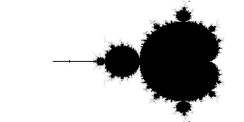

# ganja.js - Geometric Algebra for javascript.

<CENTER></CENTER>

Ganja.js is a Geometric Algebra code generator for javascript. It supports
algebra's of any signature and implements advanced operator overloading and
algebraic constants.

* Supports any metric (p,q,r) (spacelike/timelike/lightlike)
* Operator overloading
* Algebraic constants
* smallish (138 lines)
* inverses up to 5D.
* geometric, inner, outer product
* conjugate, reverse, involute, dual, negative
* 4 API's (inline, asciimath, object oriented, functional)

To use it, first include the ganja.js script.
```html
<SCRIPT SRC="https://raw.githubusercontent.com/enkimute/ganja.js/master/ganja.js"></SCRIPT>
```
### Create your algebra class.

To create an Algebra, all you need to know is its metric. The Algebra
function will generate an ES6 class that implements the algebra with the
specified metric (p,q,r). (p = # of dimensions that square to 1, q = # that
square to -1, r = # that square to 0).

```javascript
var Complex = Algebra(0,1);     // Complex numbers.
var E2 = Algebra(2);            // Euclidean 2D space.
var E3 = Algebra(3);            // Euclidean 3D space.
var timeSpace = Algebra(3,1);   // timespace
var P3 = Algebra(3,0,1);        // Projective 3D space
var C3 = Algebra(4,1);          // Conformal 3D space
```

The result of this call will be an ES6 class object (deriving from
Float64Array). These classes can be used to generate algebra elements with
all expected operators available. Apart from the (default) OO syntax, they
also provide a functional syntax (through static member functions), and two
inline syntaxes (javascript and AsciiMath).

The Inline and AsciiMath syntaxes provide in full operator overloading and 
literal algebraic objects - targetting the more mathematically inclined. The 
Object Oriented and functional syntax on the other hand will probably feel 
more familiar to engineers and programmers.  

After creating your algebra you can view its properties (metric, Cayley
table, basis names) in the console with the describe function. 

```javascript
Complex.describe();
```
To use the inline syntax call the _inline_ function passing in your function
object, for the AsciiMath syntax, you pass in a string. In both cases the
_inline_ function will return a new function object. (where e-notation and
operators are resolved) 

```javascript
// Inline javascript syntax : 
Complex.inline(function(){
  return 2 + 3e1; // 2+3i
});

// Inline AsciiMath syntax : 
Complex.inline("2+3e_1")
```
### ganja.js Syntax Overview.

Here's a list of the supported operators in all syntax flavors : 

|Inline JS | AsciiMath | Object Oriented | Functional
|----------|-----------|-----------------|------------
| ~x       |  hat(x)   | x.Conjugate     | A.Conjugate(x)
| !x       |  tilde(x) | x.Involute      | A.Involute(x)
| x.Reverse|  ddot(x)  | x.Reverse       | A.Reverse(x)
| x.Dual   |  hat(x)   | x.Dual          | A.Dual(x)
| x**-1    |  x^-1     | x.Inverse       | A.Inverse(x)
| x**y     |  x^y      | x.Pow(y)        | A.Pow(x,y)
| x*y      |  x**y     | x.Mul(y)        | A.Mul(x,y)
| x/y      |  x/y      | x.Div(y)        | A.Div(x,y)
| x^y      |  x^^y     | x.Wedge(y)      | A.Wedge(x,y)
| x<<y     |  x*y      | x.Dot(y)        | A.Dot(x,y)
| x-y      |  x-y      | x.Sub(y)        | A.Sub(x,y)
| x+y      |  x+y      | x.Add(y)        | A.Add(x,y)
| 1e1      |  1e_1     | new A([0,1])    | A.Vector(1)
| 2e2      |  2e_2     | new A([0,0,2,0])| A.Vector(0,2)
| 2e12     |  2e_12    | new A([0,0,0,2])| A.Bivector(2)

### Javascript inline syntax.

Ganja.js' inline syntax allows you to write GA statements seamlessly inside your
javascript functions. Simply wrap your functions to get full operator
overloading and algebraic constants.

To enable you to directly write algebraic constants, we overload the
scientific notation. Allowing you to write basis blade names 
**e<sub>1</sub>**, **e<sub>2</sub>**, **e<sub>12</sub>**,
**e<sub>235</sub>**, etc as : 

```javascript
// Direct algebraic objects specifying basisblades with e notation.
  var xy_bivector = 1e12;    // 1e12 = 1 time the basis xy-bivector
  var z_vector = 1e3;        // 1e3 = the basis z-vector

// Algebraic objects and operator overloading (^ = wedge) 
  var xy_bivector = 1e1^1e2; // wedge x-vector and y-vector to get the xy-bivector
```

Here are some more examples showing you the power and readability of this
API in C and R3. 

```javascript
Complex.inline(function(){
  console.log( (3+2e1)*(1+4e1) );      // complex multiplication. (outputs -5+14i)
  console.log( (1+4e1)**-1*(1+4e1) );  // complex inverse (outputs 1)
})();

E3.inline(function(){
  console.log( 1e1 );                  // x-vector (outputs [0, 1, 0, 0, 0, 0, 0, 0])
  console.log( 1e1^1e2 );              // x wedge y (outputs [0, 0, 0, 0, 1, 0, 0, 0])
  console.log( 1e12<<1e2 );            // xy dot y (outputs [0, 1, 0, 0, 0, 0, 0, 0])
  console.log( 1e1*1e2 );              // x * y (outputs [0, 0, 0, 0, 1, 0, 0, 0])
  console.log( 1e1.Dual );             // x.Dual (outputs [0, 0, 0, 0, 0, 0, -1, 0])
})();
```

### Example : Mandlebrot

In this example we use the smallest Geometric Algebra that cannonicaly
embeds the Complex numbers. We graph a two dimensional function where
we evaluate the number of iterations the complex expression (z*z+c) needs to
converge to infinity (well .. to more than two ;) ).

This famous equation is known as the Mandelbrot set. In the following piece
of javascript, z and c are complex numbers. The imaginary unit _i_ is
written **_e<sub>1</sub>_** as the first basis vector of R(0,1) squares to -1.  

```javascript
var Complex = Algebra(0,1);

var canvas = Complex.graph(function(x,y){
  var n=110, z=0e1, c=x*1.75-1+y*1e1;
  while (z < 2 && n--) z=z**2+c;
  return (n/100);
});

document.body.appendChild(canvas);
```

<CENTER></CENTER>

### Example Hue Rotor

This example uses three dimensional euclidean space which is the smallest GA
that cannonicaly embeds the quaternions. Because of our order choice of
basis blades (i.e. **e<sub>13</sub>** instead of **e<sub>31</sub>**), the
**e<sub>13</sub>** basis bivector is negated
compared to the default quaternion implementations.

In the code below, **c** is a vector and **rot** is a quaternion (scalar +
bivector). We graph the color vector obtained by rotating red (1e1) in the
(1,1,1) bivector plane. (this is changing the hue).

```javascript
var E3 = Algebra(3);

var canvas = E3.graph(function(x,y){
  var c=1e1, rot=Math.cos(x*2) + Math.sin(x*2)*(1e12+1e23-1e13);
  return (rot*c*rot**-1).Vector;
});

document.body.appendChild(canvas);
```

### Example intersecting lines in 2D

This example uses 'classic' homogenous coordinates in eucledian 3D space.
Points are represented by adding in the third basis vector
**e<sub>3</sub>**. Lines are constructed using the wedge product and the
intersection is the dual of the product of the duals.

```javascript
// Intersecting two lines in homogenous 2D.
Algebra(3).inline(function(){
  var point = (x,y) => x*1e1 + y*1e2 + 1e3;
  var meet  = (x,y) => (x.Dual*y.Dual).Dual;

 // 4 points      
  var x = point(1,1),
      y = point(2,1),
      a = point(0,3),
      b = point(0,2);

 // 2 lines
   var xy = x^y,
       ab = a^b;

 // Intersection.
   var intersect = meet(xy,ab);
    
   console.log('intersection of xy and ab = ', (intersect*intersect.e3).Vector)
})();
```
This example outputs :
```
intersection of xy and ab =  Element(3) [0, 1, 1]
```
<CENTER></CENTER>
