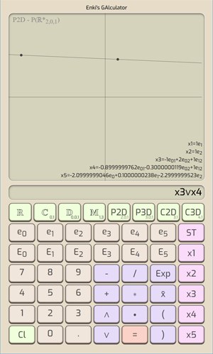
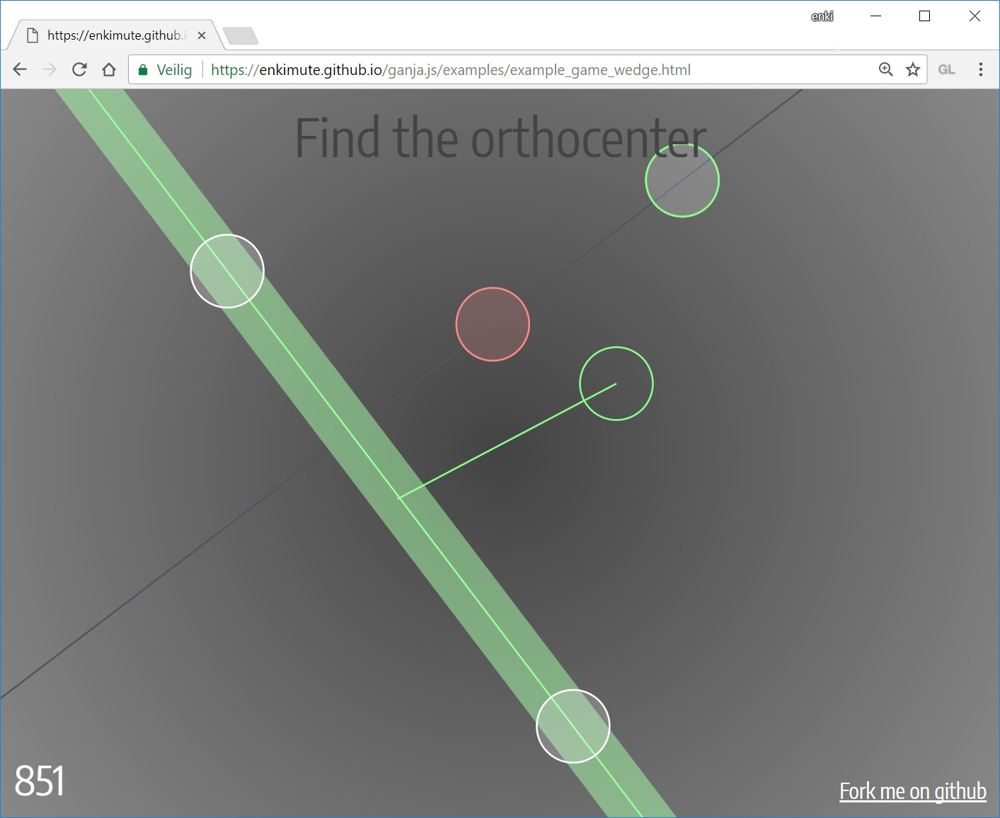
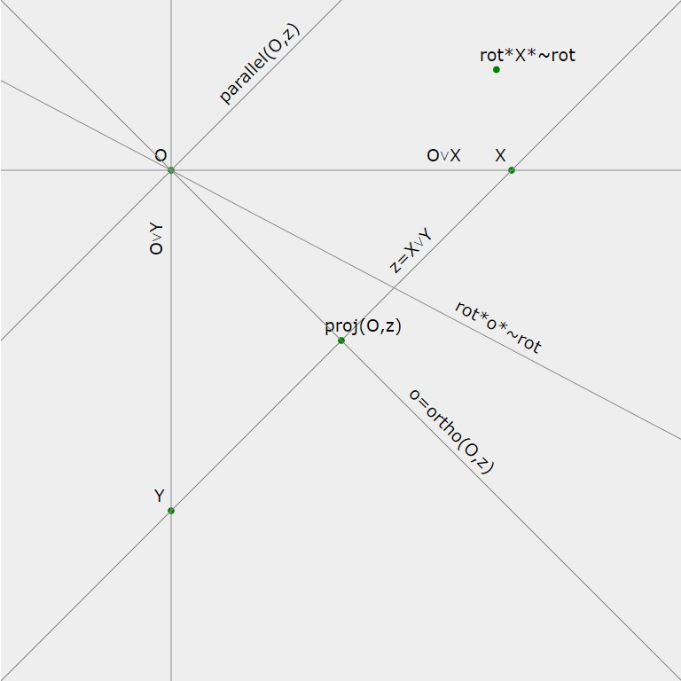

# ganja.js - Geometric Algebra for javascript.

**G**eometric **A**lgebra - **N**ot **J**ust **A**lgebra


Ganja.js is a Geometric Algebra code generator for javascript. It generates
Clifford algebras and sub-algebras of any signature and implements operator 
overloading and algebraic constants.  

(**Mathematically**, an algebra generated by ganja.js is a graded exterior (Grassmann) algebra 
(or one of its subalgebras) with a non-metric outer product, extended (Clifford) with geometric and contraction inner products, a Poincare duality operator and the main
involutions and morphisms.)

(**Technically**, ganja.js is a code generator producing classes that reificate algebraic literals 
and expressions by using reflection, a built-in tokenizer and a simple AST translator to 
rewrite functions containing algebraic constructs to their procedural counterparts.)

(**Practically**, ganja.js enables real math syntax inside javascript, with element, vector and matrix
operations over **reals**, **complex numbers**, **dual numbers**, **hyperbolic numbers**, **vectors**, **spacetime events**, **quaternions**, **dual quaternions**, **biquaternions** or **any other Clifford Algebra**.)

(**Seriously**, look at the [examples](https://enkimute.github.io/ganja.js/examples/coffeeshop.html), 
run some quick numbers using the [GAlculator](https://enkimute.github.io/ganja.js/examples/galculator.html)
or play [the wedge game](https://enkimute.github.io/ganja.js/examples/example_game_wedge.html) first.)

## Contents

[1. Reasons to use ganja](#Features)<BR>
[2. Using ganja for the first time](#Started)<BR>
[3. Getting free ganja samples](#samples)<BR>
[4. Ganja for experienced users](#custom)<BR>
[5. Ganja ingredients and syntax](#syntax)<BR>
[6. Ganja starterkit : PGA2D P(R*<sub>2,0,1</sub>)](#P2)<BR>
[7. Ganja starterkit : PGA3D P(R*<sub>3,0,1</sub>)](#P3)<BR>

<A NAME="Features"></A>
## Reasons to use ganja

Ganja.js makes doing Geometric Algebra in your browser easy and fun. Its
inline syntax and graphing makes math in the browser feel like .. math.

* Operator overloading
* Algebraic constants
* Supports any metric (positive,negative,zero) and dimensionality (also +10)  
* smallish (20kb on the wire)
* matrix-free inverses up to 5D.
* geometric, inner (left contraction), outer (wedge) and regressive (vee) product
* conjugate, Reverse, Involute, Dual (Poincare), Negative
* 4 API's (inline, asciimath, object oriented, functional)
* Easy graph function for 1D and 2D functions, Projective 2D, 3D and conformal 2D and 3D elements. (SVG/webGL/OPNS)
* Supports vectors and matrices in all its algebras.
* There's a [game](https://enkimute.github.io/ganja.js/examples/example_game_wedge.html) that teaches you how to use ganja.js !

<A NAME="Started"></A>
## Using ganja for the first time

Install ganja.js using npm :
```
npm install ganja.js
```

And require it in your script :
```javascript
var Algebra=require('ganja.js');
```

Or in the browser, just include the ganja.js script. (ganja.js has no dependencies - just 20.0kb on the wire)

```html
<SCRIPT SRC="https://unpkg.com/ganja.js"></SCRIPT>
```

### The Algebra Function

To create an Algebra, call the **_Algebra_** function specifying the metric
signature (number of positive,negative and zero dimensions). The result is 
an ES6 class implementing the requested clifford algebra.

```javascript
function Algebra( p, q, r, func );
  // p    = number of positive dimensions.
  // q    = optional number of negative dimensions.
  // r    = optional number of zero dimensions.
  // func = optional function. (shorthand .. it is passed to .inline and executed) 
```
An extended syntax is also available that allows you to further tweak the created Algebra.

``` javascript
function Algebra( options, func );
  // options = object containing subset of 
  //           { 
  //             p,            integer number of positive dimensions.
  //             q,            integer number of negative dimensions.
  //             r,            integer number of zero dimensions.
  //             metric,       [a,b,..] array with metric per generating dimensions. (e.g. [0,1,1] for PGA2D)
  //             basis,        ["1","e1","e2"] basis that overrules the standard cannonical basis.
  //             Cayley,       [["1","e1"],["e1","-1"]] Cayley table to overrule standard GA tables.
  //             baseType,     float32Array (default), float64Array, .. baseType to be used for the Elements. 
  //             mix           Set to true to enable interoperable sub-algebras. (defaults to false).
  //           }


  // returns : algebra class if no func supplied, function result if func supplied.
```
Here are some examples :

```javascript
// Basic 
var Hyper   = Algebra(1);       // Hyperbolic numbers. 
var Complex = Algebra(0,1);     // Complex numbers.
var Dual    = Algebra(0,0,1);   // Dual numbers.
var H       = Algebra(0,2);     // Quaternions.

// Clifford
var Cl2 = Algebra(2);           // Clifford algebra for 2D vector space.
var Cl3 = Algebra(3);           // Clifford algebra for 3D vector space.
var timeSpace = Algebra(1,3);   // Clifford algebra for timespace vectors.

// SubAlgebras
var Complex = Algebra({p:3,basis:['1','e123']});        // Complex Numbers as subalgebra of Cl3
var H = Algebra({p:3,basis:['1','e12','e13','e23']});   // Quaternions as even subalgebra of Cl3

// Geometric
var PGA2D = Algebra(2,0,1);     // Projective Euclidean 2D plane. (dual)
var PGA3D = Algebra(3,0,1);     // Projective Euclidean 3D space. (dual)
var CGA2D = Algebra(3,1);       // conformal 2D space. 
var CGA3D = Algebra(4,1);       // Conformal 3D space. 

// High-Dimensional GA
var DCGA3D = Algebra(6,2);      // Double Conformal 3D Space.
var TCGA3D = Algebra(9,3);      // Tripple Conformal 3D Space.
var DCGSTA = Algebra(4,8);      // Double Conformal Geometric Space Time Algebra.
var QCGA   = Algebra(9,6);      // Quadric Conformal Geometric Algebra.  
```

You can now use these classes to generate algebraic elements. Those elements will have all of the
expected properties. (Length, blade access, Dot, Wedge, Mul, Dual, Inverse, etc ...)

And while not advised you could use them in a 'classic' programming style syntax like the example below.

```javascript
var Complex = Algebra(0,1);     // Complex numbers.
var a = new Complex([3,2]);     // 3+2i
var b = new Complex([1,4]);     // 1+4i
return a.Mul(b);                // returns [-5, 14]
```
This however, is not very pretty. It's not that much fun either. Luckily,
ganja.js provides an alternate way to write algebraic functions, literals
and expressions. 

### The inline function

Your Algebra class exposes this interface through the
**_inline_** function. It accepts a javascript function, and translates it to
use the Algebra of your choice. Using the **_inline_** function, the above example is
written :

```javascript
Algebra(0,1).inline(()=>(3+2e1)*(1+4e1))();  // return [-5,14]
```
Note that if you are immediately executing the function, you can add it as a last parameter
to your Algebra constructor call. 

```javascript
Algebra(0,1,()=>(3+2e1)*(1+4e1)); // return [-5,14]
```

The inline syntax is powerful and flexible. It offers full operator
overloading, overloads scientific e-notation to allow you to directly
specify basis blades and allows using arrays or lambda expressions without 
the need for calling brackets in algebraic expressions.

```javascript
Algebra(2,0,1,()={

  // Direct specification of basis blades using e-notation.
  var xy_bivector = 1e12,
      pseudoscalar = 1e012;

  // Operator overloading .. * = geometric product, ^ = wedge, & = vee, << = dot, >>> = sandwich ... 
  var xy_bivector_from_product = 1e1 * 1e2;

  // Directly specified point.
  var some_point = 1e12 + 0.4e01 + 0.5e02;  

  // Function that returns point.
  var function_that_returns_point = ()=>some_point + 0.5e01;

  // Join of point and function .. notice no calling brackets .. 
  var join_between_point_and_function = some_point & function_that_returns_point;

  // Same line as above.. but as function.. (so will update if the point changes)
  var function_that_returns_join = ()=>some_point & function_that_returns_point;

  // Binary operations on arrays also work as expected.
  var even = [1,2,3,4,5]*2;

  // Even if those contain multivectors or other arrays : 
  var funky = [1, 1e01+0.5e02, [3,4]] * 3 + [1,2,3];

  // All elements and functions can be rendered directly. (again, no calling brackets). 
  var canvas = this.graph([ some_point, function_that_returns_point, function_that_returns_join ]);

});
```
Under the hood, ganja.js will translate these functions. 

```javascript
// the pretty mathematical expression (!=dual, ^=wedge)

a = ()=>!(!a^!b)*(c*1e23)

// gets translated to .. 

b = ()=>this.Mul(this.Dual((this.Wedge(this.Dual(a),this.Dual(b)))),(this.Mul(c,this.Coeff(6,1))))
```
In the example above, functions **a** and **b** do the same thing, but it should be clear that **_a-b=headeache_**. 
Because I'm out of aspirin, I'll leave the proof of that to the reader. 

See the [coffeeshop](https://enkimute.github.io/ganja.js/examples/coffeeshop.html) for more
examples of how to use the inline syntax.

### The graph function.

Your Algebra also exposes a static **_graph_** function that allows you to
easily graph 1D or 2D functions as well as 2D and 3D PGA and CGA elements.

* canvas output is available for 1D and 2D functions.
* SVG output is available for 2D PGA, 3D PGA and 2D CGA.
* webGL output is available for 3D PGA and 3D CGA.
* webGL2 implicit OPNS rendering is available for all other spaces.

```javascript
canvas = Algebra(0).graph(x=>Math.sin(x*5));                   // Graph a 1D function in R

canvas = Algebra(0).graph((x,y)=>x+y);                         // Graph a 2D function in R

svg = Algebra(2,0,1,()=>this.graph([1e12,1e1,1e2]));           // Graph the origin and x and y-axis in 2D PGA

svg = Algebra(3,0,1,()=>this.graph([1e123,1e23,1e13,1e12],{camera:1+.5e01-.5e02})); // and in 3D PGA

canvas = Algebra(4,1,()=>this.graph([.5e4-.5e5],{conformal:true,gl:true}); // The origin in 3D CGA
```
Again, many more examples can be found at [the coffeeshop](https://enkimute.github.io/ganja.js/examples/coffeeshop.html).

### The describe function.

To display the basis blade names, metric, Cayley table and more, use the
static **_describe_** function.

```javascript
Algebra(0,1).describe();
```
sample output :

```
Basis
1,e1
Metric
-1
Cayley
  1, e1
 e1, -1
Matrix Form:
 A,-B
 B, A
```

<A NAME="samples"></A>
## Getting free ganja samples.

Please visit [the coffeeshop](https://enkimute.github.io/ganja.js/examples/coffeeshop.html)
and play around with the examples. They are interactive and you can easily
change the code online. No need to download or install anything !

<TABLE BORDER=0 CELLSPACING=0 CELLPADDING=0>
<THEAD>
  <TR><TH WIDTH=50%></TH><TH WIDTH=50%></TH></TR>
</THEAD>
<TBODY>
<TR>
  <TD ALIGN=CENTER WIDTH="50%" STYLE="width:50%">
    complex mandelbrot<BR>
    <A HREF="https://enkimute.github.io/ganja.js/examples/coffeeshop.html#complex_mandelbrot" TARGET="_blank" TITLE="complex mandelbrot">
    </A>
  </TD>
  <TD ALIGN=CENTER WIDTH=50% STYLE="width:50%">
    complex least squares<BR>
    <A HREF="https://enkimute.github.io/ganja.js/examples/coffeeshop.html#complex_least_squares" TARGET="_blank" TITLE="complex least squares">
    </A>
  </TD>
</TR>
<TR>
  <TD ALIGN=CENTER WIDTH=50% STYLE="width:50%">
    dual differentiation<BR>
    <A HREF="https://enkimute.github.io/ganja.js/examples/coffeeshop.html#dual_differentiation" TARGET="_blank" TITLE="dual differentiation">
    </A>
  </TD>
  <TD ALIGN=CENTER WIDTH=50% STYLE="width:50%">
    dual backpropagation<BR>
    <A HREF="https://enkimute.github.io/ganja.js/examples/coffeeshop.html#dual_backpropagation" TARGET="_blank" TITLE="dual backpropagation">
    </A>
  </TD>
</TR>
<TR>
  <TD ALIGN=CENTER WIDTH=50% STYLE="width:50%">
    quaternion hue<BR>
    <A HREF="https://enkimute.github.io/ganja.js/examples/coffeeshop.html#quaternion_hue" TARGET="_blank" TITLE="quaternion hue">
    </A>
  </TD>
  <TD ALIGN=CENTER WIDTH=50% STYLE="width:50%">
    quaternion mandelbrot<BR>
    <A HREF="https://enkimute.github.io/ganja.js/examples/coffeeshop.html#quaternion_mandelbrot" TARGET="_blank" TITLE="quaternion mandelbrot">
    </A>
  </TD>
</TR>
<TR>
  <TD ALIGN=CENTER WIDTH=50% STYLE="width:50%">
    timespace lorentz<BR>
    <A HREF="https://enkimute.github.io/ganja.js/examples/coffeeshop.html#timespace_lorentz" TARGET="_blank" TITLE="timespace lorentz">
    </A>
  </TD>
  <TD ALIGN=CENTER WIDTH=50% STYLE="width:50%">
    pga2d points and lines<BR>
    <A HREF="https://enkimute.github.io/ganja.js/examples/coffeeshop.html#pga2d_points_and_lines" TARGET="_blank" TITLE="pga2d points and lines">
    </A>
  </TD>
</TR>
<TR>
  <TD ALIGN=CENTER WIDTH=50% STYLE="width:50%">
    pga2d distances and angles<BR>
    <A HREF="https://enkimute.github.io/ganja.js/examples/coffeeshop.html#pga2d_distances_and_angles" TARGET="_blank" TITLE="pga2d distances and angles">
    </A>
  </TD>
  <TD ALIGN=CENTER WIDTH=50% STYLE="width:50%">
    pga2d project and reject<BR>
    <A HREF="https://enkimute.github.io/ganja.js/examples/coffeeshop.html#pga2d_project_and_reject" TARGET="_blank" TITLE="pga2d project and reject">
    </A>
  </TD>
</TR>
<TR>
  <TD ALIGN=CENTER WIDTH=50% STYLE="width:50%">
    pga2d rotors and translators<BR>
    <A HREF="https://enkimute.github.io/ganja.js/examples/coffeeshop.html#pga2d_rotors_and_translators" TARGET="_blank" TITLE="pga2d rotors and translators">
    </A>
  </TD>
  <TD ALIGN=CENTER WIDTH=50% STYLE="width:50%">
    pga2d isometries<BR>
    <A HREF="https://enkimute.github.io/ganja.js/examples/coffeeshop.html#pga2d_isometries" TARGET="_blank" TITLE="pga2d isometries">
    </A>
  </TD>
</TR>
<TR>
  <TD ALIGN=CENTER WIDTH=50% STYLE="width:50%">
    pga2d inverse kinematics<BR>
    <A HREF="https://enkimute.github.io/ganja.js/examples/coffeeshop.html#pga2d_inverse_kinematics" TARGET="_blank" TITLE="pga2d inverse kinematics">
    </A>
  </TD>
  <TD ALIGN=CENTER WIDTH=50% STYLE="width:50%">
    pga2d separating axis<BR>
    <A HREF="https://enkimute.github.io/ganja.js/examples/coffeeshop.html#pga2d_separating_axis" TARGET="_blank" TITLE="pga2d separating axis">
    </A>
  </TD>
</TR>
<TR>
  <TD ALIGN=CENTER WIDTH=50% STYLE="width:50%">
    pga2d pose estimation<BR>
    <A HREF="https://enkimute.github.io/ganja.js/examples/coffeeshop.html#pga2d_pose_estimation" TARGET="_blank" TITLE="pga2d pose estimation">
    </A>
  </TD>
  <TD ALIGN=CENTER WIDTH=50% STYLE="width:50%">
    pga2d euler line<BR>
    <A HREF="https://enkimute.github.io/ganja.js/examples/coffeeshop.html#pga2d_euler_line" TARGET="_blank" TITLE="pga2d euler line">
    </A>
  </TD>
</TR>
<TR>
  <TD ALIGN=CENTER WIDTH=50% STYLE="width:50%">
    pga2d desargues theorem<BR>
    <A HREF="https://enkimute.github.io/ganja.js/examples/coffeeshop.html#pga2d_desargues_theorem" TARGET="_blank" TITLE="pga2d desargues theorem">
    </A>
  </TD>
  <TD ALIGN=CENTER WIDTH=50% STYLE="width:50%">
    pga2d differentiation<BR>
    <A HREF="https://enkimute.github.io/ganja.js/examples/coffeeshop.html#pga2d_differentiation" TARGET="_blank" TITLE="pga2d differentiation">
    </A>
  </TD>
</TR>
<TR>
  <TD ALIGN=CENTER WIDTH=50% STYLE="width:50%">
    pga2d physics moon<BR>
    <A HREF="https://enkimute.github.io/ganja.js/examples/coffeeshop.html#pga2d_physics_moon" TARGET="_blank" TITLE="pga2d physics moon">
    </A>
  </TD>
  <TD ALIGN=CENTER WIDTH=50% STYLE="width:50%">
    pga2d origami<BR>
    <A HREF="https://enkimute.github.io/ganja.js/examples/coffeeshop.html#pga2d_origami" TARGET="_blank" TITLE="pga2d origami">
    </A>
  </TD>
</TR>
<TR>
  <TD ALIGN=CENTER WIDTH=50% STYLE="width:50%">
    pga2d poncelet<BR>
    <A HREF="https://enkimute.github.io/ganja.js/examples/coffeeshop.html#pga2d_poncelet" TARGET="_blank" TITLE="pga2d poncelet">
    </A>
  </TD>
  <TD ALIGN=CENTER WIDTH=50% STYLE="width:50%">
    pga3d points and lines<BR>
    <A HREF="https://enkimute.github.io/ganja.js/examples/coffeeshop.html#pga3d_points_and_lines" TARGET="_blank" TITLE="pga3d points and lines">
    </A>
  </TD>
</TR>
<TR>
  <TD ALIGN=CENTER WIDTH=50% STYLE="width:50%">
    pga3d distances and angles<BR>
    <A HREF="https://enkimute.github.io/ganja.js/examples/coffeeshop.html#pga3d_distances_and_angles" TARGET="_blank" TITLE="pga3d distances and angles">
    </A>
  </TD>
  <TD ALIGN=CENTER WIDTH=50% STYLE="width:50%">
    pga3d rotors and translators<BR>
    <A HREF="https://enkimute.github.io/ganja.js/examples/coffeeshop.html#pga3d_rotors_and_translators" TARGET="_blank" TITLE="pga3d rotors and translators">
    </A>
  </TD>
</TR>
<TR>
  <TD ALIGN=CENTER WIDTH=50% STYLE="width:50%">
    pga3d icosahedron<BR>
    <A HREF="https://enkimute.github.io/ganja.js/examples/coffeeshop.html#pga3d_icosahedron" TARGET="_blank" TITLE="pga3d icosahedron">
    </A>
  </TD>
  <TD ALIGN=CENTER WIDTH=50% STYLE="width:50%">
    pga3d sampling<BR>
    <A HREF="https://enkimute.github.io/ganja.js/examples/coffeeshop.html#pga3d_sampling" TARGET="_blank" TITLE="pga3d sampling">
    </A>
  </TD>
</TR>
<TR>
  <TD ALIGN=CENTER WIDTH=50% STYLE="width:50%">
    pga3d slicing<BR>
    <A HREF="https://enkimute.github.io/ganja.js/examples/coffeeshop.html#pga3d_slicing" TARGET="_blank" TITLE="pga3d slicing">
    </A>
  </TD>
  <TD ALIGN=CENTER WIDTH=50% STYLE="width:50%">
    pga3d differentiation<BR>
    <A HREF="https://enkimute.github.io/ganja.js/examples/coffeeshop.html#pga3d_differentiation" TARGET="_blank" TITLE="pga3d differentiation">
    </A>
  </TD>
</TR>
<TR>
  <TD ALIGN=CENTER WIDTH=50% STYLE="width:50%">
    pga3d skinning<BR>
    <A HREF="https://enkimute.github.io/ganja.js/examples/coffeeshop.html#pga3d_skinning" TARGET="_blank" TITLE="pga3d skinning">
    </A>
  </TD>
  <TD ALIGN=CENTER WIDTH=50% STYLE="width:50%">
    pga3d physics planets<BR>
    <A HREF="https://enkimute.github.io/ganja.js/examples/coffeeshop.html#pga3d_physics_planets" TARGET="_blank" TITLE="pga3d physics planets">
    </A>
  </TD>
</TR>
<TR>
  <TD ALIGN=CENTER WIDTH=50% STYLE="width:50%">
    pga3d origami<BR>
    <A HREF="https://enkimute.github.io/ganja.js/examples/coffeeshop.html#pga3d_origami" TARGET="_blank" TITLE="pga3d origami">
    </A>
  </TD>
  <TD ALIGN=CENTER WIDTH=50% STYLE="width:50%">
    pga3d physics symmetric top<BR>
    <A HREF="https://enkimute.github.io/ganja.js/examples/coffeeshop.html#pga3d_physics_symmetric_top" TARGET="_blank" TITLE="pga3d physics symmetric top">
    </A>
  </TD>
</TR>
<TR>
  <TD ALIGN=CENTER WIDTH=50% STYLE="width:50%">
    pga3d physics free top<BR>
    <A HREF="https://enkimute.github.io/ganja.js/examples/coffeeshop.html#pga3d_physics_free_top" TARGET="_blank" TITLE="pga3d physics free top">
    </A>
  </TD>
  <TD ALIGN=CENTER WIDTH=50% STYLE="width:50%">
    pga3d objects<BR>
    <A HREF="https://enkimute.github.io/ganja.js/examples/coffeeshop.html#pga3d_objects" TARGET="_blank" TITLE="pga3d objects">
    </A>
  </TD>
</TR>
<TR>
  <TD ALIGN=CENTER WIDTH=50% STYLE="width:50%">
    cga2d points and circles<BR>
    <A HREF="https://enkimute.github.io/ganja.js/examples/coffeeshop.html#cga2d_points_and_circles" TARGET="_blank" TITLE="cga2d points and circles">
    </A>
  </TD>
  <TD ALIGN=CENTER WIDTH=50% STYLE="width:50%">
    cga2d project and reject<BR>
    <A HREF="https://enkimute.github.io/ganja.js/examples/coffeeshop.html#cga2d_project_and_reject" TARGET="_blank" TITLE="cga2d project and reject">
    </A>
  </TD>
</TR>
<TR>
  <TD ALIGN=CENTER WIDTH=50% STYLE="width:50%">
    cga2d rotors and translators<BR>
    <A HREF="https://enkimute.github.io/ganja.js/examples/coffeeshop.html#cga2d_rotors_and_translators" TARGET="_blank" TITLE="cga2d rotors and translators">
    </A>
  </TD>
  <TD ALIGN=CENTER WIDTH=50% STYLE="width:50%">
    cga2d euler line<BR>
    <A HREF="https://enkimute.github.io/ganja.js/examples/coffeeshop.html#cga2d_euler_line" TARGET="_blank" TITLE="cga2d euler line">
    </A>
  </TD>
</TR>
<TR>
  <TD ALIGN=CENTER WIDTH=50% STYLE="width:50%">
    cga3d points circles lines<BR>
    <A HREF="https://enkimute.github.io/ganja.js/examples/coffeeshop.html#cga3d_points_circles_lines" TARGET="_blank" TITLE="cga3d points circles lines">
    </A>
  </TD>
  <TD ALIGN=CENTER WIDTH=50% STYLE="width:50%">
    cga3d points spheres planes<BR>
    <A HREF="https://enkimute.github.io/ganja.js/examples/coffeeshop.html#cga3d_points_spheres_planes" TARGET="_blank" TITLE="cga3d points spheres planes">
    </A>
  </TD>
</TR>
<TR>
  <TD ALIGN=CENTER WIDTH=50% STYLE="width:50%">
    cga3d dual spheres planes<BR>
    <A HREF="https://enkimute.github.io/ganja.js/examples/coffeeshop.html#cga3d_dual_spheres_planes" TARGET="_blank" TITLE="cga3d dual spheres planes">
    </A>
  </TD>
  <TD ALIGN=CENTER WIDTH=50% STYLE="width:50%">
    cga3d intersections<BR>
    <A HREF="https://enkimute.github.io/ganja.js/examples/coffeeshop.html#cga3d_intersections" TARGET="_blank" TITLE="cga3d intersections">
    </A>
  </TD>
</TR>
<TR>
  <TD ALIGN=CENTER WIDTH=50% STYLE="width:50%">
    cga3d project reject<BR>
    <A HREF="https://enkimute.github.io/ganja.js/examples/coffeeshop.html#cga3d_project_reject" TARGET="_blank" TITLE="cga3d project reject">
    </A>
  </TD>
  <TD ALIGN=CENTER WIDTH=50% STYLE="width:50%">
    cga3d opns visualizer<BR>
    <A HREF="https://enkimute.github.io/ganja.js/examples/coffeeshop.html#cga3d_opns_visualizer" TARGET="_blank" TITLE="cga3d opns visualizer">
    </A>
  </TD>
</TR>
<TR>
  <TD ALIGN=CENTER WIDTH=50% STYLE="width:50%">
    cga3d opns line circle<BR>
    <A HREF="https://enkimute.github.io/ganja.js/examples/coffeeshop.html#cga3d_opns_line_circle" TARGET="_blank" TITLE="cga3d opns line circle">
    </A>
  </TD>
  <TD ALIGN=CENTER WIDTH=50% STYLE="width:50%">
    cga3d json<BR>
    <A HREF="https://enkimute.github.io/ganja.js/examples/coffeeshop.html#cga3d_json" TARGET="_blank" TITLE="cga3d json">
    </A>
  </TD>
</TR>
<TR>
  <TD ALIGN=CENTER WIDTH=50% STYLE="width:50%">
    mga3d points and lines<BR>
    <A HREF="https://enkimute.github.io/ganja.js/examples/coffeeshop.html#mga3d_points_and_lines" TARGET="_blank" TITLE="mga3d points and lines">
    </A>
  </TD>
  <TD ALIGN=CENTER WIDTH=50% STYLE="width:50%">
    ccga3d points quadrics<BR>
    <A HREF="https://enkimute.github.io/ganja.js/examples/coffeeshop.html#ccga3d_points_quadrics" TARGET="_blank" TITLE="ccga3d points quadrics">
    </A>
  </TD>
</TR>
<TR>
  <TD ALIGN=CENTER WIDTH=50% STYLE="width:50%">
    qcga3d points and more<BR>
    <A HREF="https://enkimute.github.io/ganja.js/examples/coffeeshop.html#qcga3d_points_and_more" TARGET="_blank" TITLE="qcga3d points and more">
    </A>
  </TD>
  <TD ALIGN=CENTER WIDTH=50% STYLE="width:50%">
    game wedge<BR>
    <A HREF="https://enkimute.github.io/ganja.js/examples/coffeeshop.html#game_wedge" TARGET="_blank" TITLE="game wedge">
    </A>
  </TD>
</TR>
</TBODY>
</TABLE>

ganja.js is also the engine behind the GAlculator - try it [online](https://enkimute.github.io/ganja.js/examples/galculator.html) or get it on the [play store](https://play.google.com/store/apps/details?id=io.github.enkimute) 

<A HREF="https://enkimute.github.io/ganja.js/examples/galculator.html" TARGET="_blank"></A>

Or - get some hands on experience with euclidian plane PGA by playing the [wedge game](https://enkimute.github.io/ganja.js/examples/example_game_wedge.html).

<A HREF="https://enkimute.github.io/ganja.js/examples/example_game_wedge.html" TARGET="_blank"></A>


<A NAME="custom"></A>
## Ganja for experienced users.

Ganja.js allows you to further customise the algebra class it
generates, allowing you to generate subalgebras (who's elements use
less storage), or algebra's where you decide on the order and name
of the basis blades. (the name should always be e<sub>xyz</sub> but
you can pick e.g. e<sub>20</sub> instead of the default e<sub>02</sub>
and expect ganja.js to make appropriate sign changes)

The advanced options are available by passing in an options object as
the first parameter to the *Algebra* call.  

### Custom subalgebra's

```javascript

// The complex numbers as the even subalgebra of R2 
C = Algebra({p:2,basis:['1','e12']});

// The Quaternions as the even subalgebra of R3
var H = Algebra({p:3,basis:['1','e12','e13','e23']});  

```

### Custom basis names.

When not specified, ganja.js will generate basis names that are
grouped by rank and numerically sorted. By default, a single zero
dimension will get generator name e<sub>0</sub>. Zero dimensions come
first. 

|signature|default basis names
|---|---
|2,0,0 and 1,1,0|1,e<sub>1</sub>,e<sub>2</sub>,e<sub>12</sub>
|1,0,1|1,e<sub>0</sub>,e<sub>1</sub>,e<sub>01</sub>
|3,0,0 and 2,1,0|1,e<sub>1</sub>,e<sub>2</sub>,e<sub>3</sub>,e<sub>12</sub>,e<sub>13</sub>,e<sub>23</sub>,e<sub>123</sub>
|2,0,1|1,e<sub>0</sub>,e<sub>1</sub>,e<sub>2</sub>,e<sub>01</sub>,e<sub>02</sub>,e<sub>12</sub>,e<sub>012</sub>
|4,0,0 and 3,1,0|1,e<sub>1</sub>,e<sub>2</sub>,e<sub>3</sub>,e<sub>4</sub>,e<sub>12</sub>,e<sub>13</sub>,e<sub>14</sub>,e<sub>23</sub>,e<sub>24</sub>,e<sub>34</sub>,e<sub>123</sub>,e<sub>124</sub>,e<sub>134</sub>,e<sub>234</sub>,e<sub>1234</sub>
|3,0,1|1,e<sub>0</sub>,e<sub>1</sub>,e<sub>2</sub>,e<sub>3</sub>,e<sub>01</sub>,e<sub>02</sub>,e<sub>03</sub>,e<sub>12</sub>,e<sub>13</sub>,e<sub>23</sub>,e<sub>012</sub>,e<sub>013</sub>,e<sub>023</sub>,e<sub>123</sub>,e<sub>0123</sub>

*note* the scalar part of a multivector **"mv"** can be addressed with **"mv.s"**, other basis
blades follow the expected pattern. e.g. **"mv.e12"** or **"mv.e012"**. 

By default, your algebra elements will inherit from Float32Array.
You can change the underlying datatype used by ganja.js to any of the
typed array basis types :

```javascript

var R3_32 = Algebra(3);

var R3_64 = Algebra({p:3,baseType:Float64Array});

```

### Custom Cayley Table

Or take things a bit further and simply specify a Cayley table to your liking. The example below shows
automatic numerical differentiation and calculates the value, 1st, 2nd and 3rd derivative of any polynomial.

```javascript
var basis=['1','e1','e2','e3'];
var Cayley=[['1', 'e1','e2','e3'],
            ['e1','e2','e3', '0'],
            ['e2','e3', '0', '0'],
            ['e3', '0', '0', '0']];

Algebra({basis,Cayley},()=>{
  var f = (x)=>0.25*x*x*x*x-0.5; 
  for (var i=-5; i<5; i++) console.log( i, f(i+1e1) );
});
```
outputs : x [f(x),f'(x),f''(x)/2!,f'''(x)/3!]
```
-5 [155.75, -125, 37.5, -5]
-4 [  63.5,  -64,   24, -4]
-3 [ 19.75,  -27, 13.5, -3]
-2 [   3.5,   -8,    6, -2]
-1 [ -0.25,   -1,  1.5, -1]
0  [  -0.5,    0,    0,  0]
1  [ -0.25,    1,  1.5,  1]
2  [   3.5,    8,    6,  2]
3  [ 19.75,   27, 13.5,  3]
4  [  63.5,   64,   24,  4]
```
### Mixed mode.

For storage and performance reasons it can be interesting to combine elements of various sub-algebras of
a given Algebra. Ganja.js supports this by setting options.mix to true when you create your algebra.

```javascript
// Create R2 - Clifford algebra of 2D vectors - indicate you want mix mode.
var R2 = Algebra({p:2,q:0,r:0,mix:true}); 

// Create the complex numbers as the even subalgebra of R2.
var C  = Algebra({p:2,q:0,r:0,basis:['1','e12'],mix:true});

// Elements of R2 have four components.
// Create the complex number 1+4i
var a=new R2([1,0,0,4])

// Elements of C have two components.
// Create the complex number 3+2i
var b=new C([3,2]); 

// They inter-operate ..
a.Mul(b);   // returns an element of R2 : [-5,0,0,14]
b.Mul(a);   // returns an element of C  : [-5,14]
```
With the **mix** mode enabled, all operations generated by ganja.js will use basis name access
instead of array indexing. (and all operations are protected to substitute missing blades with 0).

The Inline syntax can still be used, keep in mind that in most cases you would want that to be
the inline function of the 'parent' algebra. (In the example above, use R2.Inline and not C.Inline 
as the latter will reduce all your operations to the field of C). 

<A NAME="syntax"></A>
## Ganja ingredients and syntax.

Here's a list of the supported operators in all syntax flavors : 

Please note that operator precedence is as always in javaScript, except
for Wedge, Vee, Dot and Sandwich which have higher precedence than * and /,
resulting in less brackets in many common GA expressions.

|Precedence |Inline JS | AsciiMath | Object Oriented | Functional
|-----------|----------|-----------|-----------------|------------
|5          | x.Involute|  tilde(x) | x.Involute      | A.Involute(x)
|5          | x.Reverse|  ddot(x)  | x.Reverse       | A.Reverse(x)
|5          | ~x       |  hat(x)   | x.Conjugate     | A.Conjugate(x)
|5          | !x       |  bar(x)   | x.Dual          | A.Dual(x)
|4 rtl      | x**-1    |  x^-1     | x.Inverse       | A.Inverse(x)
|4 rtl      | x**y     |  x^y      | x.Pow(y)        | A.Pow(x,y)
|3          | x^y      |  x^^y     | x.Wedge(y)      | A.Wedge(x,y)
|3          | x<<y     |  x*y      | x.Dot(y)        | A.Dot(x,y)
|3          | x&y      |  bar(bar(x)^^bar(y)) | x.Vee(y) | A.Vee(x,y)
|3          | x>>>y    |  x ** y ** hat(x) | x.Mul(y).Mul(x.Conjugate) | A.sw(x,y)
|2          | x*y      |  x**y     | x.Mul(y)        | A.Mul(x,y)
|2          | x/y      |  x/y      | x.Div(y)        | A.Div(x,y)
|1          | x-y      |  x-y      | x.Sub(y)        | A.Sub(x,y)
|1          | x+y      |  x+y      | x.Add(y)        | A.Add(x,y)
|           | 1e1      |  1e_1     | new A([0,1])    | A.Vector(1)
|           | 2e2      |  2e_2     | new A([0,0,2,0])| A.Vector(0,2)
|           | 2e12     |  2e_12    | new A([0,0,0,2])| A.Bivector(2)

### Duality

The Duality operator implements Poincare duality, a definition and implementation that works
even if the pseudoscalar of the subspace in consideration is degenerate. It is defined for any
k-vector **x**  of an n-dimensional subspace as the n-k vector **y** containing all the basis 
vectors that are not in **x**. For non-degenerate metrics, you can still use multiplication
with the pseudoscalar if so desired (although it will be less efficient)

### Dot Product

The dot product implemented is the left contraction - without any extensions or modifications.
The geometric meaning is usually formulated as the dot product between **x** and **y** gives the orthogonal
complement in **y** of the projection of **x** onto **y**.

### Vee product

The vee product is available as an optimized shorthand for the dual of the wedge of the duals.

```
a&b = !(!a^!b)
```  
I've chosen the **&** symbol as it can be interpreted as 'join' or 'meet' depending on the geometric
meaning given to vectors. (planes/lines or points) 


<A NAME="P2"></A>
## Ganja starterkit : PGA2D P(R*<sub>2,0,1</sub>)

Want to get started quickly with 2D Projective Geometric Algebra ? The
boiler plate below gets you going with a bunch of usefull identities. 
(and the coffeeshop has plenty of examples).

We start off with a clifford algebra with signature (2,0,1). We then
upgrade it to a geometric algebra by extending it with geometric
operators. (this is where we decide our bivectors will be points,
effectively making this P(R*<sub>2,0,1</SUB>). 

Simply include the ganja.js script and put the block below in a **SCRIPT** tag
to get started .. 

```javascript
// Create a Clifford Algebra with 2 positive and one zero generator.
Algebra(2,0,1,()=>{
    
    // Output algebra info to the console.
    this.describe();
    
    // The default basis is s,e0,e1,e2,e01,e02,e12,e012
    // The metric for vectors is    0,  1,  1 - Vectors will represent lines.
    // The metric for bivectors is  0,  0, -1 - Bivectors will represent points.
    // The pseudoscalar is degenerate, so use the built-in duality operator instead.
    
    // The bivectors consist of two motor elements and one rotation element -
    // exactly what is needed to represent translations and rotations in the plane.
    
    // In dual projectivized space, the origin is represented by the e12 bivector.
    var origin = 1e12, EX=-1e02, EY=1e01;
    
    // Points and lines can be specified directly. (note : -e02 = e20)
    var point = (x,y)=>origin+x*EX+y*EY;
    var line  = (a,b,c)=>a*1e1+b*1e2+c*1e0;
    
    // Or through join and meet operations. (dual so wedge is meet and vee is join.)
    var join = (p1,p2)=>p1&p2;
    var meet = (l1,l2)=>l1^l2;
    
    // Distances and angles
    var dist_points     = (P1,P2)=>(P1.Normalized&P2.Normalized).Length;
    var dist_point_line = (P,l)=>((P.Normalized)^(l.Normalized)).e012;
    var angle_lines     = (l1,l2)=>(l1.Normalized<<l2.Normalized).s;
  
    // Points and lines can be projected and rejected.
    var project         = (P,l)=>P<<l*l;
    var parallel        = (P,l)=>P<<l*P;
    var ortho           = (P,l)=>P<<l;
  
    // translations and rotations.
    var rotor           = (a,P)=>Math.cos(a*0.5)+Math.sin(a*0.5)*P;
    var translator      = (x,y)=>1+0.5*(x*1e02-y*1e01); 
    
    // To demonstrate graphing, we create some points and lines.
    // Users can drag points in the graph, lambda expressions can be
    // used to create dynamic updating items.
    var A = point(-1,-1), B = point(1,-1), C = point(-1,1), l = line(-1,1,0.5);
    
    // Ganja.js can directly graph 2D PGA elements. Pass in an array of
    // items to render. (numbers are colors, strings are labels, PGA points
    // and lines are rendered automatically and arrays can be used for line
    // segments and polygons). The graph function returns a HTML SVG element.
    document.body.appendChild(this.graph([
      // use numbers to set the current color.    
        0x444444,
      // strings label the items they follow, first string is a title.    
        "title",
      // render points (user can drag these)     
        A, B, C, "Label for point",
      // render lines    
        l,"Label for line",
      // line segments
        ()=>[A,B], "Label for segment",
      // polygons
        0xffeeee,
        ()=>[A,B,C], 0xff7777, "Label for polygon"
    ],{grid:true, animate:false}));
    
    // When using the animation mode, all lambda's will be evaluated every frame.
    // Use Date.now() or similar. (many examples in the coffeeshop.)
});
```



<A NAME="P3"></A>
## Ganja starterkit : PGA3D P(R*<sub>3,0,1</sub>)


This example implements the table on page 15 of [Gunn's Geometric Algebra for Computer Graphics](http://page.math.tu-berlin.de/~gunn/Documents/Papers/GAforCGTRaw.pdf). 
We apply the same strategy from above and start from a Clifford Algebra in R<sub>3,0,1</sub>. 

```javascript
// Create a Clifford Algebra with 3 positive and one zero generator.
Algebra(3,0,1,()=>{
    
    // Output algebra info to the console.
    this.describe();
    
    // The default basis is 1,e0,e1,e2,e3,e01,e02,e03,e12,e13,e23,e012,e013,e023,e123,e0123
    // The metric for vectors is     0, 1, 1,  1          - Vectors will represent planes.
    // The metric for bivectors is   0, 0, 0, -1, -1, -1  - Bivectors will represent lines.
    // The metric for trivectors is  0, 0, 0, -1          - Trivectors will represent points.
    // The pseudoscalar is degenerate, so use the built-in duality operator instead.
    
    // The bivectors consist of three motor elements and three rotation element -
    // exactly what is needed to represent translations and rotations in euclidean space.
    
    // In dual projectivized space, the origin is represented by the e12 bivector.
    var origin=1e123, EX=-1e012, EY=1e013, EZ=-1e023;
    
    // Points and planes can be specified directly.
    var point = (x,y,z)=>origin+x*EX+y*EY+z*EZ,
        plane = (a,b,c,d)=>a*1e1+b*1e2+c*1e3+d*1e0;
    
    // Table from "Geometric Algebra for Computer Graphics" p.15
    var LineFromPoints            = (P,Q)=>P&Q,
        LineFromPlanes            = (a,b)=>a^b,
        PointFromPlanes           = (a,b,c)=>a^b^c,
        PlaneFromPoints           = (P,Q,R)=>P&Q&R,
        DistPointToPlane          = (a,P)=>a&P,
        DistPoints                = (P,Q)=>(P&Q).Length,
        AnglePlanes               = (a,b)=>Math.acos((a<<b).Length),
        LineThroughPointPerpPlane = (P,a)=>P<<a,
        OrthProjPointToPlane      = (P,a)=>P<<a*a,
        PlaneThroughPointParPlane = (P,a)=>P<<a*P,
        IntersectLinePlane        = (PI,a)=>PI^a,
        PlaneThroughPointPerpLine = (PI,P)=>P<<PI,
        OrthProjPointToLine       = (PI,P)=>P<<PI*PI,
        LineThroughPointParLine   = (PI,P)=>P<<PI*P,
        LineThroughPointPerpLine  = (PI,P)=>(P<<PI*P)&P,
        DistLines                 = (PI,EP)=>PI&EP,
        AngleLines                = (PI,EP)=>Math.acos((PI<<EP).Length),
        ReflectionInPlane         = (a,X)=>a*X*a,
        Rotor                     = (PI,alpha)=>Math.cos(alpha/2) + Math.sin(alpha/2)*PI,
        RotationAroundLine        = (X,PI,alpha)=>Rotor(PI,alpha)*X*~Rotor(PI,alpha),
        Translator                = (x,y,z)=>1+0.5*(x*EX+y*EY+z*EZ);
    
    // To demonstrate graphing, we create some points and lines.
    // Users can drag points in the graph, lambda expressions can be
    // used to create dynamic updating items.
    var A = point(-1,-1, 0), B = point(1,-1, 0), C = point(-1,1,0);
    
    // Ganja.js can directly graph 3D PGA elements. Pass in an array of
    // items to render. (numbers are colors, strings are labels, PGA points
    // and lines are rendered automatically and arrays can be used for line
    // segments and polygons). The graph function returns a HTML SVG element.
    document.body.appendChild(this.graph([
      // use numbers to set the current color.    
        0x444444,
      // strings label the items they follow, first string is a title.    
        "title",
      // render points (user can drag these)     
        A, B, C, "Label for point",
      // render lines    
        ()=>(B&C&A)<<(B&C)<<-A,"Label for line",
      // line segments
        ()=>[A,B], "Label for segment",
      // polygons
        0xffeeee,
        ()=>[A,B,C], 0xff7777, "Label for polygon"
    ],{grid:false, animate:false}));
    
    // When using the animation mode, all lambda's will be evaluated every frame.
    // Use Date.now() or similar. (many examples in the coffeeshop.)
});
```


