# ganja.js - Geometric Algebra for javascript.

**G**eometric **A**lgebra - **N**ot **J**ust **A**lgebra


Ganja.js is a Geometric Algebra code generator for javascript. It generates
Clifford algebras and sub-algebras of any signature and implements operator 
overloading and algebraic constants.  

(**Mathematically**, an algebra generated by ganja.js is a graded exterior (Grassmann) algebra 
(or one of its subalgebras) with a non-metric outer product, extended (Clifford) with geometric and contraction inner products, a Poincare duality operator and the main
involutions and automorphisms.)

(**Technically**, ganja.js is a code generator producing classes that reificate algebraic literals 
and expressions by using reflection, a built-in tokenizer and a simple AST translator to 
rewrite functions containing algebraic constructs to their procedural counterparts.)

(**Seriously**, look at the [examples](https://enkimute.github.io/ganja.js/examples/coffeeshop.html) first.)

### Contents

[1. Reasons to use ganja](#Features)<BR>
[2. Using ganja for the first time](#Started)<BR>
[3. Ganja for experienced users](#custom)<BR>
[4. Getting free ganja samples](#samples)<BR>
[5. Ganja ingredients and syntax](#syntax)<BR>
[6. Ganja starterkit : PGA2D P(R*<sub>2,0,1</sub>)](#P2)<BR>
[7. Ganja starterkit : PGA3D P(R*<sub>3,0,1</sub>)](#P3)<BR>

<A NAME="Features"></A>
### Reasons to use ganja

Ganja.js makes doing Geometric Algebra in your browser easy and fun. It's
inline syntax and graphing makes math in the browser feel like .. math.

* Operator overloading
* Algebraic constants
* Supports any metric (positive,negative,zero)
* smallish (173 lines)
* matrix-free inverses up to 5D.
* geometric, inner (contraction), outer (wedge) and vee product
* conjugate, Reverse, Involute, Dual (Poincare), Negative
* 4 API's (inline, asciimath, object oriented, functional)
* Easy graph function for 1D and 2D functions and Projective 2D elements.

<A NAME="Started"></A>
### Using ganja for the first time

Start off by including the ganja.js script. (ganja.js has no dependencies - just 7.9kb on the wire)

```html
<SCRIPT SRC="https://raw.githubusercontent.com/enkimute/ganja.js/master/ganja.js"></SCRIPT>
```
#### The Algebra Function

To create an Algebra, call the **_Algebra_** function specifying the metric
signature (number of positive,negative and zero dimensions). The result is 
an ES6 class implementing the requested clifford algebra.

```javascript
var Complex = Algebra(0,1);     // Complex numbers.
var Cl2 = Algebra(2);           // Clifford algebra for 2D vectors.
var Cl3 = Algebra(3);           // Clifford algebra for 3D vectors.
var timeSpace = Algebra(3,1);   // timespace
var PGA3D = Algebra(3,0,1);     // Projective Euclidean 3D space
var CGA3D = Algebra(4,1);       // Conformal Euclidean 3D space
```

You can now use this class to generate elements of your algebra. Those elements will have all of the
expected properties. (Length, blade access, Dot, Wedge, Mul, Dual, Inverse, etc ...)

And while not advised you could use them in a 'classic' programming style syntax like the example below.

```javascript
var Complex = Algebra(0,1);     // Complex numbers.
var a = new Complex([3,2]);     // 3+2i
var b = new Complex([1,4]);     // 1+4i
return a.Mul(b);                // returns [-5, 14]
```
This however, is not very pretty. It's not that much fun either. Luckily,
ganja.js provides an alternate way to write algebraic functions, literals
and expressions. 

#### The inline function

Your Algebra class exposes this interface through the
**_inline_** function. Using the **_inline_** function, the above example is
written :

```javascript
Algebra(0,1).inline(()=>(3+2e1)*(1+4e1))();  // return [-5,14]
```
The inline syntax is powerful and flexible. It offers full operator
overloading, overloads scientific e-notation to allow you to directly
specify basis blades and allows using lambda expressions without the need
for calling brackets in algebraic expressions.

```javascript
Algebra(2,0,1).inline(()={

  // Direct specification of basis blades using e-notation.
  var xy_bivector = 1e12,
      pseudoscalar = 1e012;

  // Operator overloading .. * = geometric product, ^ = wedge, & = vee, << = dot, >>> = sandwich ... 
  var xy_bivector_from_product = 1e1 * 1e2;

  // Directly specified point.
  var some_point = 1e12 + 0.4e01 + 0.5e02;  

  // Function that returns point.
  var function_that_returns_point = ()=>some_point + 0.5e01;

  // Join of point and function .. notice no calling brackets .. 
  var join_between_point_and_function = some_point & function_that_returns_point;

  // Same line as above.. but as function.. (so will update if the point changes)
  var function_that_returns_join = ()=>some_point & function_that_returns_point;

  // All elements and functions can be rendered directly. (again, no calling brackets). 
  var canvas = this.graph([ some_point, function_that_returns_point, function_that_returns_join ]);

})();
```
Under the hood, ganja.js will translate these functions. 

```javascript
// the pretty mathematical expression (!=dual, ^=wedge)

a = ()=>!(!a^!b)*(c*1e23)

// gets translated to .. 

b = ()=>this.Mul(this.Dual((this.Wedge(this.Dual(a),this.Dual(b)))),(this.Mul(c,this.Coeff(6,1))))
```
In the example above, functions **a** and **b** do the same thing, but it should be clear that **_a-b=headeache_**. 
Because I'm out of aspirin, I'll leave the proof of that to the reader. 

See the [coffeeshop](https://enkimute.github.io/ganja.js/examples/coffeeshop.html) for more
examples of how to use the inline syntax.

#### The graph function.

Your Algebra also exposes a static **_graph_** function that allows you to
easily graph 1D or 2D functions as well as 2D PGA elements.

```javascript
canvas = Algebra(0).graph(x=>Math.sin(x*5));            // Graph a 1D function in R

canvas = Algebra(0).graph((x,y)=>x+y);                  // Graph a 2D function in R

svg = Algebra(2,0,1).graph(()=>[1e12,1e1,1e2]);         // Graph the origin and x and y-axis
```
Again, many more examples can be found at [the coffeeshop](https://enkimute.github.io/ganja.js/examples/coffeeshop.html).

#### The describe function.

To display the basis blade names, metric, Cayley table and more, use the
static **_describe_** function.

```javascript
Algebra(0,1).describe();
```

<A NAME="custom"></A>
### Ganja for experienced users.

Ganja.js allows you to further customise the algebra class it
generates, allowing you to generate subalgebras (who's elements use
less storage), or algebra's where you decide on the order and name
of the basis blades. (the name should always be e<sub>xyz</sub> but
you can pick e.g. e<sub>20</sub> instead of the default e<sub>02</sub>
and expect ganja.js to make appropriate sign changes)

The advanced options are available by passing in an options object as
the first parameter to the *Algebra* call.  

```javascript

// The complex numbers as the even subalgebra of R2 
C = Algebra({p:2,basis:['1','e12']});

// The Quaternions as the even subalgebra of R3
H = Algebra({p:3,basis:['e23','e31','e12','1']});     

```
When not specified, ganja.js will generate basis names that are
grouped by rank and numerically sorted. By default, a single zero
dimension will get generator name e<sub>0</sub> and will take
the first place. 

|signature|default basis names
|---|---
|2,0,0 and 1,1,0|1,e1,e2,e12
|1,0,1|1,e0,e1,e01
|3,0,0 and 2,1,0|1,e1,e2,e3,e12,e13,e23,e123
|2,0,1|1,e0,e1,e2,e01,e02,e12,e012
|4,0,0 and 3,1,0|1,e1,e2,e3,e4,e12,e13,e14,e23,e24,e34,e123,e124,e134,e234,e1234
|3,0,1|1,e0,e1,e2,e3,e01,e02,e03,e12,e13,e23,e012,e013,e023,e123,e0123

*note* the scalar part of a multivector can be addressed with "mv.s", other basis
blades follow the expected pattern. e.g. "mv.e12" or "mv.e012". 

By default, your algebra elements will inherit from Float32Array.
You can change the underlying datatype used by ganja.js to any of the
typed array basis types :

```javascript

var R3_32 = Algebra(3);

var R3_64 = Algebra({p:3,baseType:Float64Array});

```

<A NAME="samples"></A>
### Getting free ganja samples.

Please visit [the coffeeshop](https://enkimute.github.io/ganja.js/examples/coffeeshop.html)
and play around with the examples. They are interactive and you can easily
change the code online. No need to download or install anything !

<TABLE BORDER=0 CELLSPACING=0 CELLPADDING=0>
<TR><TD ALIGN=CENTER>
Complex Mandelbrot<BR>
<A HREF="https://enkimute.github.io/ganja.js/examples/coffeeshop.html#complex_mandelbrot"           TARGET="_blank" TITLE="Complex Mandelbrot">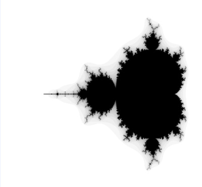</A>
<TD ALIGN=CENTER>
Mandelbrot with Quaternion Hue colorisation<BR>
<A HREF="https://enkimute.github.io/ganja.js/examples/coffeeshop.html#quaternion_mandelbrot"        TARGET="_blank" TITLE="PGA2D Distances and Angles">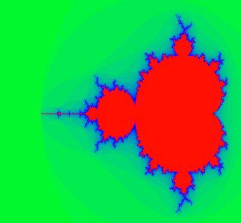</A>
<TR><TD ALIGN=CENTER>
PGA2D Points and Lines<BR>
<A HREF="https://enkimute.github.io/ganja.js/examples/coffeeshop.html#pga2d_points_and_lines"       TARGET="_blank" TITLE="PGA2D Points and Lines">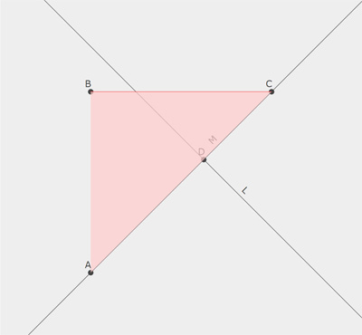</A>
<TD ALIGN=CENTER>
PGA2D Distances and Angles<BR>
<A HREF="https://enkimute.github.io/ganja.js/examples/coffeeshop.html#pga2d_distances_and_angles"   TARGET="_blank" TITLE="PGA2D Distances and Angles">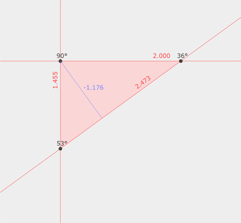</A>
<TR><TD ALIGN=CENTER>
PGA2D Project and Reject<BR>
<A HREF="https://enkimute.github.io/ganja.js/examples/coffeeshop.html#pga2d_project_and_reject"     TARGET="_blank" TITLE="PGA2D Project and Reject">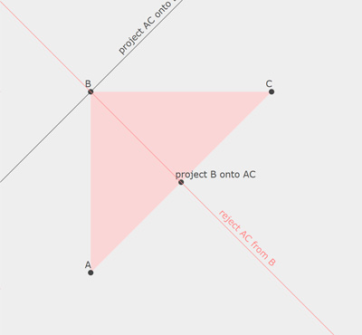</A>
<TD ALIGN=CENTER>
PGA2D Rotors and Translators<BR>
<A HREF="https://enkimute.github.io/ganja.js/examples/coffeeshop.html#pga2d_rotors_and_translators" TARGET="_blank" TITLE="PGA2D Rotors and Translators">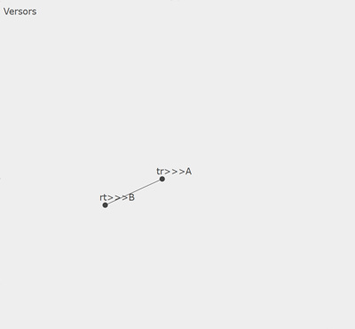</A>
<TR><TD ALIGN=CENTER>
PGA2D Isometries<BR>
<A HREF="https://enkimute.github.io/ganja.js/examples/coffeeshop.html#pga2d_isometries"             TARGET="_blank" TITLE="PGA2D Isometries">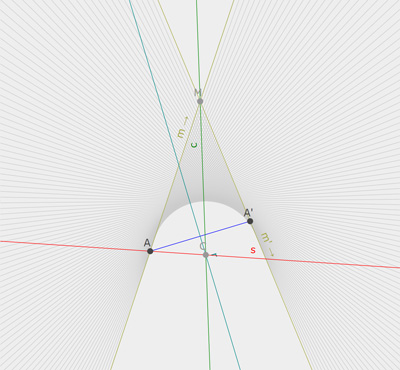</A>
<TD ALIGN=CENTER>
PGA2D Inverse Kinematics<BR>
<A HREF="https://enkimute.github.io/ganja.js/examples/coffeeshop.html#pga2d_inverse_kinematics"     TARGET="_blank" TITLE="PGA2D Inverse Kinematics">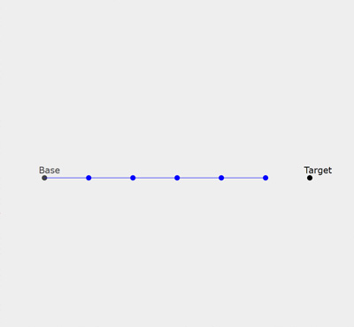</A>
<TR><TD ALIGN=CENTER>
PGA2D Separating Axis<BR>
<A HREF="https://enkimute.github.io/ganja.js/examples/coffeeshop.html#pga2d_separating_axis"        TARGET="_blank" TITLE="PGA2D Separating Axis">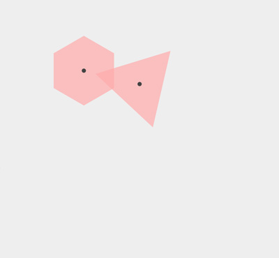</A>
<TD ALIGN=CENTER>
PGA2D Pose Estimation<BR>
<A HREF="https://enkimute.github.io/ganja.js/examples/coffeeshop.html#pga2d_pose_estimation"        TARGET="_blank" TITLE="PGA2D Pose Estimation">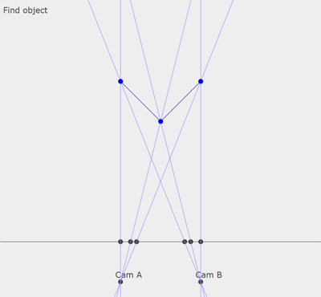</A>
<TR><TD ALIGN=CENTER>
PGA2D Euler Line<BR>
<A HREF="https://enkimute.github.io/ganja.js/examples/coffeeshop.html#pga2d_euler_line"             TARGET="_blank" TITLE="PGA2D Euler Line">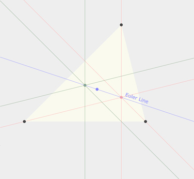</A>
<TD ALIGN=CENTER>
PGA2D Desargues Theorem<BR>
<A HREF="https://enkimute.github.io/ganja.js/examples/coffeeshop.html#pga2d_desargues_theorem"      TARGET="_blank" TITLE="PGA2D Desargues Theorem">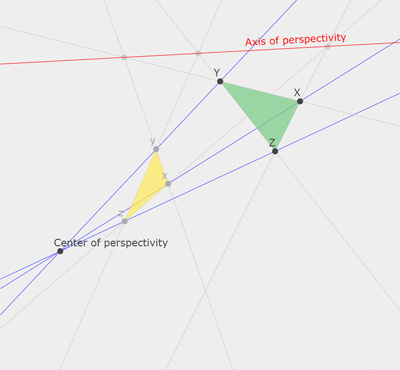</A>
</TABLE>

<A NAME="syntax"></A>
### Ganja ingredients and syntax.

Here's a list of the supported operators in all syntax flavors : 

|Inline JS | AsciiMath | Object Oriented | Functional
|----------|-----------|-----------------|------------
| ~x       |  hat(x)   | x.Conjugate     | A.Conjugate(x)
| x.Involute|  tilde(x) | x.Involute      | A.Involute(x)
| x.Reverse|  ddot(x)  | x.Reverse       | A.Reverse(x)
| !x       |  bar(x)   | x.Dual          | A.Dual(x)
| x**-1    |  x^-1     | x.Inverse       | A.Inverse(x)
| x**y     |  x^y      | x.Pow(y)        | A.Pow(x,y)
| x*y      |  x**y     | x.Mul(y)        | A.Mul(x,y)
| x/y      |  x/y      | x.Div(y)        | A.Div(x,y)
| x^y      |  x^^y     | x.Wedge(y)      | A.Wedge(x,y)
| x<<y     |  x*y      | x.Dot(y)        | A.Dot(x,y)
| x&y      |  bar(bar(x)^^bar(y)) | x.Vee(y) | A.Vee(x,y)
| x>>>y    |  x ** y ** hat(x) | x.Mul(y).Mul(x.Conjugate) | A.sw(x,y)
| x-y      |  x-y      | x.Sub(y)        | A.Sub(x,y)
| x+y      |  x+y      | x.Add(y)        | A.Add(x,y)
| 1e1      |  1e_1     | new A([0,1])    | A.Vector(1)
| 2e2      |  2e_2     | new A([0,0,2,0])| A.Vector(0,2)
| 2e12     |  2e_12    | new A([0,0,0,2])| A.Bivector(2)

<A NAME="P2"></A>
### Ganja starterkit : PGA2D P(R*<sub>2,0,1</sub>)

Want to get started quickly with 2D Projective Geometric Algebra ? The boiler plate below gets you going with a bunch of usefull identities. (and the coffeeshop has plenty of examples).

We start off with a clifford algebra with signature (2,0,1). 

```javascript
var PGA2D = Algebra(2,0,1);
```

Next, we upgrade it to a geometric algebra by extending it with geometric
operators. (this is where we decide our bivectors will be points,
effectively making this P(R*<sub>2,0,1</SUB>). 

```javascript
PGA2D.inline(function(){ 
  this.point           = (X,Y)=>1e12-X*1e02+Y*1e01;
  this.line            = (a,b,c)=>a*1e1+b*1e2+c*1e0;
  this.join            = (x,y)=>x&y;
  this.meet            = (x,y)=>x^y;
  this.dist_points     = (P1,P2)=>(P1.Normalized&P2.Normalized).Length;
  this.dist_point_line = (P,l)=>((P.Normalized)^(l.Normalized)).e012;
  this.angle_lines     = (l1,l2)=>(l1.Normalized<<l2.Normalized).s;
  this.project         = (P,l)=>(P<<l)*l;
  this.parallel        = (P,l)=>(P<<l)*P;
  this.ortho           = (P,l)=>P<<l;
  this.rotor           = (a,P)=>Math.cos(a*0.5)+Math.sin(a*0.5)*P;
  this.translator      = (x,y)=>1+0.5*(x*1e20-y*1e01);
})();
```
We can now use our 2D Projective Algebra. We'll use the graph function to
visualize some algebraic objects (i.e. lines and points).

```javascript
PGA2D.inline(function(){ 

   var O = PGA2D.point(-1,-1), 
       Y = PGA2D.point( 1,-1), 
       X = PGA2D.point(-1, 1),
       z = PGA2D.join(Y,X),
       o = -1*PGA2D.ortho(O,z),
       rot = this.rotor(0.3,O);

   document.body.appendChild(this.graph({
     O,X,Y,
     "color1"        : 0xff0000,
     "O˅X"           : PGA2D.join(O,X),
     "O˅Y"           : PGA2D.join(Y,O),
     "z=X˅Y"         : z,
     "color2"        : 0x008800,
     "o=ortho(O,z)"  : o,
     "parallel(O,z)" : PGA2D.parallel(O,z),
     "rot*o*~rot"    : rot>>>o,
     "color3"        : 0x8888ff,
     "proj(O,z)"     : PGA2D.project(O,z),
     "rot*X*~rot"    : rot>>>X,
   }))

})();
```


<A NAME="P3"></A>
### Ganja starterkit : PGA3D P(R*<sub>3,0,1</sub>)


This example implements the table on page 15 of [Gunn's Geometric Algebra for Computer Graphics](http://page.math.tu-berlin.de/~gunn/Documents/Papers/GAforCGTRaw.pdf). 
We apply the same strategy from above and start from a Clifford Algebra in R<sub>3,0,1</sub>. 

```javascript
var P3 = Algebra({
           metric:[0,1,1,1],
           basis:['1','e0','e1','e2','e3','e01','e02','e03','e12','e31','e23','e123','e012','e031','e023','e0123']
         });
```
Extending it with geometric operators to form P(R*<sub>3,0,1</sub>). 

```javascript
P3.inline(function(){ 
  // We extend the basic (clifford) algebra with PGA specific items.
  // Easier names for triVectors.  
    var E0=1e123, E1=1e012, E2=1e031, E3=1e023;
  // Homogenous points.
    this.point    = (X,Y,Z)=>E0+X*E1+Y*E2+(Z||0)*E3,
    this.to_point = (p)=>p.e123?[p.e012/p.e123,p.e023/p.e123,p.e031/p.e123]
                        :[p.e012*Infinity||0,p.e023*Infinity||0,p.e031*Infinity||0],
  // Join and Meet
    this.join = (x,y)=>x&y;
    this.meet = (x,y)=>x^y;
  // Table from "Geometric Algebra for Copmuter Graphics" p.15
    this.LineFromPoints            = (P,Q)=>P3.join(P,Q);
    this.LineFromPlanes            = (a,b)=>a^b;
    this.PointFromPlanes           = (a,b,c)=>a^b^c;
    this.PlaneFromPoints           = (P,Q,R)=>P3.join(P3.join(P,Q),R);
    this.DistPointToPlane          = (a,P)=>P3.join(a,P);
    this.DistPoints                = (P,Q)=>P3.join(P,Q).Length;
    this.AnglePlanes               = (a,b)=>Math.acos((a<<b).Length);
    this.LineThroughPointPerpPlane = (P,a)=>P<<a;
    this.OrthProjPointToPlane      = (P,a)=>(P<<a)*a;
    this.PlaneThroughPointParPlane = (P,a)=>(P<<a)*P;
    this.IntersectLinePlane        = (PI,a)=>PI^a;
    this.PlaneThroughPointPerpLine = (PI,P)=>P<<PI;
    this.OrthProjPointToLine       = (PI,P)=>(P<<PI)*PI;
    this.LineThroughPointParLine   = (PI,P)=>(P<<PI)*P;
    this.LineThroughPointPerpLine  = (PI,P)=>P3.join((P<<PI)*P,P);
    this.DistLines                 = (PI,EP)=>P3.join(PI,EP);
    this.AngleLines                = (PI,EP)=>Math.acos((PI<<EP).Length);
    this.ReflectionInPlane         = (a,X)=>a*X*a;
    this.Rotor                     = (PI,alpha)=>Math.cos(alpha/2) + Math.sin(alpha/2)*PI;
    this.RotationAroundLine        = (X,PI,alpha)=>this.rotor(PI,alpha)*X*~this.rotor(PI,alpha);
    this.Translator                = (x,y,z)=>1+0.5*(x*1e03+y*1e01+z*1e02);
})();

```
Resulting in P3, the geometric algebra for projective euclidean space.

```javascript
P3.inline(function(){ 
// points
  var o=P3.point(0,0,0), x=P3.point(1,0,0), y=P3.point(0,1,0), z=P3.point(0,0,1);
// lines
  var ox=P3.LineFromPoints(o,x), oy=P3.LineFromPoints(o,y);
// planes
  var oxy=P3.PlaneFromPoints(o,x,y), oyz=P3.PlaneFromPoints(o,y,z), xyz=P3.PlaneFromPoints(x,y,z);
// distance
  console.log('distances |o,x| and |x,y| = ',P3.DistPoints(o,x),',', P3.DistPoints(x,y));
// angles
  console.log('angles lines |ox,oy| and |ox,ox| = ',P3.AngleLines(ox,oy),',',P3.AngleLines(ox,ox));
  console.log('angles planes |oxy,oyz| and |oxy,oxy| =',P3.AnglePlanes(oxy,oyz),',',P3.AnglePlanes(oxy,oxy));
// projection
  console.log('project o onto xyz = ',P3.to_point(P3.OrthProjPointToPlane(o,xyz)));
// rotation and translation
  var tran = P3.Translator(2,3,4), rot = P3.Rotor(x,Math.PI);
  console.log('x translated 2,3,4 = ',P3.to_point(tran*x*~tran));
  console.log('o rotated PI around x = ',P3.to_point(rot*o*~rot));
})();
```

