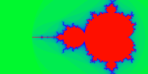
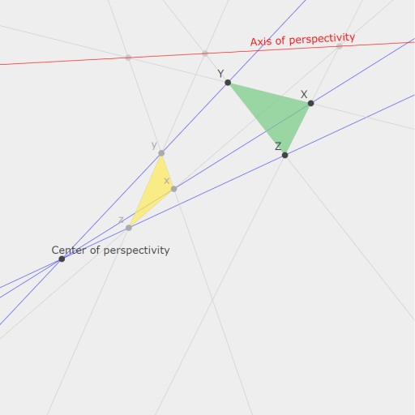

# ganja.js - Geometric Algebra for javascript.

**G**eometric **A**lgebra - **N**ot **J**ust **A**lgebra


Ganja.js is a Geometric Algebra code generator for javascript. It generates
Clifford algebras and sub-algebras of any signature and implements operator 
overloading and algebraic constants.  

(**Mathematically**, an algebra generated by ganja.js is a graded exterior (Grassmann) algebra 
(or one of its subalgebras) with a non-metric outer product, extended (Clifford) with geometric and contraction inner products, a Poincare duality operator and the main
involutions and automorphisms.)

(**Technically**, ganja.js is a code generator producing classes that reificate algebraic literals 
and expressions by using reflection, a built-in tokenizer and a simple AST translator to 
rewrite functions containing algebraic constructs to their procedural counterparts.)

(**Seriously**, look at the examples first.)

### Contents

[1. Features](#Features)<BR>
[2. Getting started](#Started)<BR>
[3. Subalgebra's, custom blade names, ...](#custom)<BR>
[4. Syntax overview](#syntax)<BR>
[5. Inline operators and Algebraic Literals](#inline)<BR>
[6. Example : R<sub>0,1</sub> Complex Numbers Mandelbrot](#C)<BR>
[7. Example : R<sub>3</sub> Color Space Hue Rotor](#R3)<BR>
[8. Example : R<SUP>+</SUP><sub>3</sub> Quaternions](#H)<BR>
[9. Example : P(R*<sub>2,0,1</sub>) Projective 2D](#P2)<BR>
[10. Example : P(R*<sub>2,0,1</sub>) Desargues's Theorem](#P2B)<BR>
[11. Example : P(R*<SUB>2,0,1</sub>) Inverse Kinematics](#P2C)<BR>
[12. Example : P(R*<sub>3,0,1</sub>) Projective 3D](#P3)<BR>

<A NAME="Features"></A>
### Features

* Supports any metric (positive,negative,zero)
* Operator overloading
* Algebraic constants
* smallish (162 lines)
* matrix-free inverses up to 5D.
* geometric, inner (contraction), outer product
* conjugate, reverse, involute, dual (Poincare), negative
* 4 API's (inline, asciimath, object oriented, functional)
* Easy graph function for 1D and 2D functions and Projective 2D elements.

To use it, first include the ganja.js script.
```html
<SCRIPT SRC="https://raw.githubusercontent.com/enkimute/ganja.js/master/ganja.js"></SCRIPT>
```
<A NAME="Started"></A>
### Getting started

To create an Algebra, call the *_Algebra_* function specifying the metric
signature (positive,negative,zero). This function will generate an ES6 class 
implementing the graded clifford algebra with the given signature. 


```javascript
var Complex = Algebra(0,1);     // Complex numbers.
var R2 = Algebra(2);            // 2D vector space.
var R3 = Algebra(3);            // 3D vector space.
var timeSpace = Algebra(3,1);   // timespace
var P3 = Algebra(3,0,1);        // Projective Euclidean 3D space
var C3 = Algebra(4,1);          // Conformal Euclidean 3D space
```

The result of this call will be an ES6 class object (deriving from
Float64Array). This class can be used to generate algebra elements with
all expected operators available. Apart from the (default) OO syntax, they
also provide a functional syntax (through static member functions), and two
inline syntaxes (javascript and AsciiMath).

The Inline and AsciiMath syntaxes provide in full operator overloading and 
literal algebraic objects - targetting the more mathematically inclined. The 
Object Oriented and functional syntax on the other hand will probably feel 
more familiar to engineers and programmers.  

After creating your algebra you can view its properties (metric, Cayley
table, basis names, etc) in the console with the *_describe_* function. 

```javascript
Complex.describe();
```
To use the inline syntax call the *_inline_* function passing in a function
object, for the AsciiMath syntax, you pass in a string. In both cases the
return value will be a function. (where e-notation and operators are resolved) 

```javascript
// Inline javascript syntax : 
Complex.inline(function(){
  return 2 + 3e1; // 2+3i
});

// Inline AsciiMath syntax : 
Complex.inline("2+3e_1")
```
See the examples below for more examples of how to use the inline syntax.
(the inline syntax is the preferred syntax). 

<A NAME="custom"></A>
### Subalgebra's, custom blade names, ..

Ganja.js allows you to further customise the algebra class it
generates, allowing you to generate subalgebras (who's elements use
less storage), or algebra's where you decide on the order and name
of the basis blades. (the name should always be e<sub>xyz</sub> but
you can pick e.g. e<sub>20</sub> instead of the default e<sub>02</sub>
and expect ganja.js to make appropriate sign changes)

The advanced options are available by passing in an options object as
the first parameter to the *Algebra* call.  

```javascript

// The complex numbers as the even subalgebra of R2 
C = Algebra({p:2,basis:['1','e12']});

// The Quaternions as the even subalgebra of R3
H = Algebra({p:3,basis:['e23','e31','e12','1']});     

```
When not specified, ganja.js will generate basis names that are
grouped by rank and numerically sorted. By default, a single zero
dimension will get generator name e<sub>0</sub> and will take
the first place. 

<A NAME="syntax"></A>
### Syntax overview.

Here's a list of the supported operators in all syntax flavors : 

|Inline JS | AsciiMath | Object Oriented | Functional
|----------|-----------|-----------------|------------
| ~x       |  hat(x)   | x.Conjugate     | A.Conjugate(x)
| x.Involute|  tilde(x) | x.Involute      | A.Involute(x)
| x.Reverse|  ddot(x)  | x.Reverse       | A.Reverse(x)
| !x       |  bar(x)   | x.Dual          | A.Dual(x)
| x**-1    |  x^-1     | x.Inverse       | A.Inverse(x)
| x**y     |  x^y      | x.Pow(y)        | A.Pow(x,y)
| x*y      |  x**y     | x.Mul(y)        | A.Mul(x,y)
| x/y      |  x/y      | x.Div(y)        | A.Div(x,y)
| x^y      |  x^^y     | x.Wedge(y)      | A.Wedge(x,y)
| x<<y     |  x*y      | x.Dot(y)        | A.Dot(x,y)
| x>>>y    |  x ** y ** hat(x) | x.Mul(y).Mul(x.Conjugate) | A.sw(x,y)
| x-y      |  x-y      | x.Sub(y)        | A.Sub(x,y)
| x+y      |  x+y      | x.Add(y)        | A.Add(x,y)
| 1e1      |  1e_1     | new A([0,1])    | A.Vector(1)
| 2e2      |  2e_2     | new A([0,0,2,0])| A.Vector(0,2)
| 2e12     |  2e_12    | new A([0,0,0,2])| A.Bivector(2)

<A NAME="inline"></A>
### Inline operators and Algebraic Literals.

Ganja.js' inline syntax allows you to write GA statements seamlessly inside your
javascript functions. Simply wrap your functions to get full operator
overloading and algebraic constants.

```javascript
// Create an algebra. (the basis will be [1,e1] with e1*e1=-1)
  var Complex = Algebra(0,1);

// Write a function with algebraic expressions and literals.
  var myFunction = function() { return (3+2e1)*(1+4e1); };

// Translate the function (this replaces literals and operators by appropriate calls.)
  myFunction = Complex.inline(myFunction)

// Call it.
  console.log(myFunction()); 
```
The entire example above could be written shorter :

```javascript
  Algebra(0,1).inline(()=>console.log((3+2e1)*(1+4e1)))();
```
Here the imaginary unit *_i_* is the first basis vector and
written in scientific notation as *1e1* (to represent e<sub>1</sub>). Ganja.js
overloads the scientific notation so you can directly specify basis blades 
**e<sub>1</sub>**, **e<sub>2</sub>**, **e<sub>12</sub>**, **e<sub>235</sub>**, etc as : 

```javascript
Algebra(3,0,1).inline(function(){

// Direct algebraic objects specifying basisblades with e notation.
  var xy_bivector = 1e12;    // 1e12 = 1 time the basis xy-bivector
  var z_vector = 1e3;        // 1e3 = the basis z-vector

// Algebraic objects and operator overloading (^ = wedge) 
  var xy_bivector = 1e1^1e2; // wedge x-vector and y-vector to get the xy-bivector

})();
```
Here are some more examples showing you the power and readability of this
API in C and R3. 

```javascript
Complex.inline(function(){
  console.log( (3+2e1)*(1+4e1) );      // complex multiplication. (outputs -5+14i)
  console.log( (1+4e1)**-1*(1+4e1) );  // complex inverse (outputs 1)
})();

R3.inline(function(){
  console.log( 1e1 );                  // x-vector (outputs [0, 1, 0, 0, 0, 0, 0, 0])
  console.log( 1e1^1e2 );              // x wedge y (outputs [0, 0, 0, 0, 1, 0, 0, 0])
  console.log( 1e12<<1e2 );            // xy dot y (outputs [0, 1, 0, 0, 0, 0, 0, 0])
  console.log( 1e1*1e2 );              // x * y (outputs [0, 0, 0, 0, 1, 0, 0, 0])
  console.log( 1e1.Dual );             // x.Dual (outputs [0, 0, 0, 0, 0, 0, -1, 0])
})();
```
<A NAME="C"></A>
### Example : R<sub>0,1</sub> Complex Numbers Mandelbrot

In this example we use the smallest Geometric Algebra that cannonicaly
embeds the Complex numbers. We graph a two dimensional function where
we evaluate the number of iterations the complex expression (z*z+c) needs to
converge to infinity (well .. to more than two ;) ).

This famous equation is known as the Mandelbrot set. In the following piece
of javascript, z and c are complex numbers. The imaginary unit _i_ is
written **_e<sub>1</sub>_** as the first basis vector of R(0,1) squares to -1.  

```javascript
var Complex = Algebra(0,1);

var canvas = Complex.graph(function(x,y){
  var n=110, z=0e1, c=x*1.75-1+y*1e1;
  while (z < 2 && n--) z=z**2+c;
  return (n/100);
});

document.body.appendChild(canvas);
```

<CENTER></CENTER>

<A NAME="R3"></A>
### Example : R<sub>3</sub> Color Space Hue Rotor

This example uses three dimensional vector space R<sub>3</sub> which is the smallest GA
that cannonicaly embeds the quaternions. Because of our order choice of
basis blades (i.e. **e<sub>13</sub>** instead of **e<sub>31</sub>**), the
**e<sub>13</sub>** basis bivector is negated
compared to the default quaternion implementations.

In the code below, **c** is a vector and **rot** is a quaternion (scalar +
bivector). We graph the color vector obtained by rotating red (1e1) in the
(1,1,1) bivector plane. (this is changing the hue).

```javascript
var R3 = Algebra(3);

var canvas = R3.graph(function(x,y){
  var c=1e1, rot=Math.cos(x*2) + Math.sin(x*2)*(1e12+1e23-1e13);
  return (rot*c*rot**-1).Vector;
});

document.body.appendChild(canvas);
```
<CENTER></CENTER>

<A NAME="H"></A>
### Example : R<SUP>+</SUP><sub>3</sub> Quaternions

We'll combine the two examples above and graph a colorised Mandelbrot
fractal. We'll use the minimal required algebra for this which is the
even subalgebra of R<SUB>3</SUB> known as H - the Quaternions.

The elements in this example will have 4 coefficients (scalar,
e<Sub>12</sub>, e<sub>13</sub>, e<sub>23</sub>)

```javascript
document.body.appendChild(Algebra({p:3,basis:['1','e12','e13','e23']}).graph(function(x,y){
// Calculate iteration count for mandelbrot.
  var n=40, z=0e12, c=x*1.75-1+y*1e12;
  while (z < 2 && n--) z=z**2+c;
// Use the iteration count to rotate the color red in the hue plane  
  var red=1e12, rot=Math.cos(n/20) + Math.sin(n/20)*(0.578e12+0.578e13+0.578e23);
  return (rot*red*~rot).slice(1);
}));
```
This example outputs : 

<CENTER></CENTER>

<A NAME="P2"></A>
### Example : P(R*<sub>2,0,1</sub>) Projective 2D

This example uses projective 2D. (degenerate signature R*2,0,1). (Dual ..
i.e. points are higher grade than lines). (Ganja.js can handle degenerate
metrics). Points are constructed by adding in E0, and the join is the dual of the
wedge of the duals. (meet is just wedge). We construct lines from points
and find their intersection points, angles, distances and more.

We've also used a custom ordering of the basis blades, and used
**e<sub>20</sub>** instead of the default **e<sub>02</sub>**. This matches
the convention of Charles Gunn (refer to his publications for more information
on projective geometric algebra). 

We start by creating an R<sub>2,0,1</sub> Clifford Algebra with given basis
names. (Ganja.js will handle duality and inner product correctly even for degenerate
metrics.)

```javascript
var P2 = Algebra({metric:[0,1,1],basis:['1','e0','e1','e2','e12','e20','e01','e012']});
```
Next, we upgrade it to a geometric algebra by extending it with geometric
operators. (this is where we decide our bivectors will be points,
effectively making this P(R*<sub>2,0,1</SUB>). 

```javascript
P2.inline(function(){ 
  this.point           = (X,Y)=>1e12+X*1e20+Y*1e01;
  this.to_point        = (p)=>`[${p.e12?[p.e01/p.e12,p.e20/p.e12]:[p.e01*Infinity||0,p.e20*Infinity||0]}]`;
  this.to_line         = (p)=>`${p.e1}x + ${p.e2}y + ${p.e0}`;
  this.join            = (x,y)=>!(!x^!y);                               // union
  this.meet            = (x,y)=>x^y;                                    // intersect 
  this.dist_points     = (p1,p2)=>this.join(p1/p1.e12,p2/p2.e12).Length;// distance between points
  this.dist_point_line = (p,l)=>((p.Normalized)^(l.Normalized)).e012;   // oriented distance point to line.
  this.angle_lines     = (l1,l2)=>(l1.Normalized<<l2.Normalized).s;     // angle between lines
  this.project         = (p,l)=>(p<<l)*l;                               // project p onto l
  this.parallel        = (p,l)=>(p<<l)*p;                               // line parallel to l and through p.
  this.ortho           = (p,l)=>p<<l;                                   // line ortho to l and through p.
  this.rotor           = (a,p)=>Math.cos(a*0.5)+Math.sin(a*0.5)*p;      // rotor a around p
  this.translator      = (x,y)=>1+0.5*(x*1e20-y*1e01);                  // translator x,y
})();
```
We can now use our 2D Projective Algebra. We'll use the graph function to
visualize some algebraic objects (i.e. lines and points).

```javascript
P2.inline(function(){ 
   var O=P2.point(-1,-1), X=P2.point(1,-1), Y=P2.point(-1,1),
       z=P2.join(Y,X),o=-1*P2.ortho(O,z),rot=this.rotor(0.3,O);
   document.body.appendChild(this.graph({
     O,X,Y,
     "color1"        : 0xff0000,
     "O˅X"           : P2.join(O,X),
     "O˅Y"           : P2.join(Y,O),
     "z=X˅Y"         : z,
     "color2"        : 0x008800,
     "o=ortho(O,z)"  : o,
     "parallel(O,z)" : P2.parallel(O,z),
     "rot*o*~rot"    : rot*o*~rot,
     "color3"        : 0x8888ff,
     "proj(O,z)"     : P2.project(O,z),
     "rot*X*~rot"    : rot*X*~rot,
   }))
})();
```

This example outputs :


<A NAME="P2B"></A>
### Example : P(R*<sub>2,0,1</sub>) Desargues's Theorem

A classic example in projective geometry : [Desargues's Theorem on Wikipedia](https://en.wikipedia.org/wiki/Desargues%27s_theorem).

This example passes an array of render commands to the graph function. The type of the elements in that array determines what graph
will do (numbers will set the color, algebraic objects are rendered as expected, strings are labels and arrays of points are rendered
as polygons). Arrow functions will be evaluated every time the user interacts with the graph. 

```javascript
Algebra(2,0,1).inline(()=>{ 
  var O=1e12+1.4e02+0.5e01, X=1e12-1e02-1e01, Y=1e12-0.2e02-1.2e01, Z=1e12-0.75e02-0.5e01, 
      x,y,z, yx,yz,xz, YX,YZ,XZ;
  document.body.appendChild(this.graph([
  // calculate derived points.
    ()=>{x=(0.55*O+0.45*X);y=(0.4*O+0.6*Y);z=(0.7*O+0.3*Z)},
  // Blue lines through triangle vertices  
    0x4444ff, ()=>!(!O^!X), ()=>!(!O^!Y), ()=>!(!O^!Z),
  // Grey lines extending triangle edges  
    0xcccccc, ()=>YZ=!(!Y^!Z), ()=>yz=!(!y^!z), ()=>YZ^yz,
              ()=>XZ=!(!X^!Z), ()=>xz=!(!x^!z), ()=>XZ^xz,
              ()=>YX=!(!Y^!X), ()=>yx=!(!y^!x), ()=>YX^yx,
  // Render the two triangles.            
    0x76cc82, [X,Y,Z],
    0xffeb57, ()=>[x,y,z],
  // Render and label derived points (x,y,z)  
    0xaaaaaa, ()=>x, "x", ()=>y, "y", ()=>z, "z", 
  // Render axis of perspectivity  
    0xff0000, ()=>!(!(XZ^xz)^!(YX^yx)), "Axis of perspectivity",
  // All the way on top, render the original input points X, Y, Z and O  
    0x444444, X, "X", Y, "Y", Z, "Z", O, "Center of perspectivity", 
  ]));
})();
```

Please note that these examples are interactive. (not on github)



<A NAME="P3"></A>
### Example : P(R*<sub>3,0,1</sub>) Projective 3D

This example implements the table on page 15 of [Gunn's Geometric Algebra for Computer Graphics](http://page.math.tu-berlin.de/~gunn/Documents/Papers/GAforCGTRaw.pdf). 
We apply the same strategy from above and start from a Clifford Algebra in R<sub>3,0,1</sub>. 

```javascript
var P3 = Algebra({
           metric:[0,1,1,1],
           basis:['1','e0','e1','e2','e3','e01','e02','e03','e12','e31','e23','e123','e012','e031','e023','e0123']
         });
```
Extending it with geometric operators to form P(R*<sub>3,0,1</sub>). 

```javascript
P3.inline(function(){ 
  // We extend the basic (clifford) algebra with PGA specific items.
  // Easier names for triVectors.  
    var E0=1e123, E1=1e012, E2=1e031, E3=1e023;
  // Homogenous points.
    this.point    = (X,Y,Z)=>E0+X*E1+Y*E2+(Z||0)*E3,
    this.to_point = (p)=>p.e123?[p.e012/p.e123,p.e023/p.e123,p.e031/p.e123]
                        :[p.e012*Infinity||0,p.e023*Infinity||0,p.e031*Infinity||0],
  // Join and Meet
    this.join = (x,y)=>!(!x^!y);
    this.meet = (x,y)=>x^y;
  // Table from "Geometric Algebra for Copmuter Graphics" p.15
    this.LineFromPoints            = (P,Q)=>P3.join(P,Q);
    this.LineFromPlanes            = (a,b)=>a^b;
    this.PointFromPlanes           = (a,b,c)=>a^b^c;
    this.PlaneFromPoints           = (P,Q,R)=>P3.join(P3.join(P,Q),R);
    this.DistPointToPlane          = (a,P)=>P3.join(a,P);
    this.DistPoints                = (P,Q)=>P3.join(P,Q).Length;
    this.AnglePlanes               = (a,b)=>Math.acos((a<<b).Length);
    this.LineThroughPointPerpPlane = (P,a)=>P<<a;
    this.OrthProjPointToPlane      = (P,a)=>(P<<a)*a;
    this.PlaneThroughPointParPlane = (P,a)=>(P<<a)*P;
    this.IntersectLinePlane        = (PI,a)=>PI^a;
    this.PlaneThroughPointPerpLine = (PI,P)=>P<<PI;
    this.OrthProjPointToLine       = (PI,P)=>(P<<PI)*PI;
    this.LineThroughPointParLine   = (PI,P)=>(P<<PI)*P;
    this.LineThroughPointPerpLine  = (PI,P)=>P3.join((P<<PI)*P,P);
    this.DistLines                 = (PI,EP)=>P3.join(PI,EP);
    this.AngleLines                = (PI,EP)=>Math.acos((PI<<EP).Length);
    this.ReflectionInPlane         = (a,X)=>a*X*a;
    this.Rotor                     = (PI,alpha)=>Math.cos(alpha/2) + Math.sin(alpha/2)*PI;
    this.RotationAroundLine        = (X,PI,alpha)=>this.rotor(PI,alpha)*X*~this.rotor(PI,alpha);
    this.Translator                = (x,y,z)=>1+0.5*(x*1e03+y*1e01+z*1e02);
})();

```
Resulting in P3, the geometric algebra for projective euclidean space.

```javascript
P3.inline(function(){ 
// points
  var o=P3.point(0,0,0), x=P3.point(1,0,0), y=P3.point(0,1,0), z=P3.point(0,0,1);
// lines
  var ox=P3.LineFromPoints(o,x), oy=P3.LineFromPoints(o,y);
// planes
  var oxy=P3.PlaneFromPoints(o,x,y), oyz=P3.PlaneFromPoints(o,y,z), xyz=P3.PlaneFromPoints(x,y,z);
// distance
  console.log('distances |o,x| and |x,y| = ',P3.DistPoints(o,x),',', P3.DistPoints(x,y));
// angles
  console.log('angles lines |ox,oy| and |ox,ox| = ',P3.AngleLines(ox,oy),',',P3.AngleLines(ox,ox));
  console.log('angles planes |oxy,oyz| and |oxy,oxy| =',P3.AnglePlanes(oxy,oyz),',',P3.AnglePlanes(oxy,oxy));
// projection
  console.log('project o onto xyz = ',P3.to_point(P3.OrthProjPointToPlane(o,xyz)));
// rotation and translation
  var tran = P3.Translator(2,3,4), rot = P3.Rotor(x,Math.PI);
  console.log('x translated 2,3,4 = ',P3.to_point(tran*x*~tran));
  console.log('o rotated PI around x = ',P3.to_point(rot*o*~rot));
})();
```
